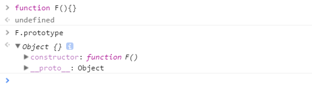

# 一. JS类型判断
基本类型： null, undefined, number, string, boolean, symbol

对象类型: object
## 1. `typeof`(返回值为string类型)
- 对于基本类型，除了null之外均返回正确值
```javascript
  typeof null // object
  typeof undefined // undefined
  typeof 1 // number
  typeof true // boolean
  typeof '1' // string
  typeof Symbol() // symbol
```
- 对于对象类型，除了function外均返回object
```javascript
  typeof new Date() // object
  typeof console.log // function
```
## 2. `instanceof`(返回值为boolean类型)
- 原理
```bash
instanceof (A,B) = {
    var L = A.__proto__;
    var R = B.prototype;
    if(L === R) {
        // A的内部属性 __proto__ 指向 B 的原型对象时，就认为 A 就是 B 的实例
        return true;
    }
    return false;
}
```
- 判断两个对象是否属于实例关系， 而不能判断实例具体类型
```javascript
  [] instanceof Array // true
  [] instanceof Object // true
```

[ ].__proto__  指向 Array.prototype，而 Array.prototype.__proto__ 又指向了Object.prototype，最终 Object.prototype.__proto__ 指向了null，标志着原型链的结束


- 不能跨框架

eg. 框架0的数组无法在框架1判定是否为Array的实例对象
```javascript
  xArray = window.frames[0].Array;
  var arr = new xArray(1,2,3); // [1,2,3]
  arr instanceof Array; // false
```
`[解决方法]`
 使用Array.isArray() 方法 。该方法用以确认某个对象本身是否为 Array 类型，而不区分该对象在哪个环境中创建。


## 3. `constructor`
1. 函数 F被定义时，JS引擎会为F添加 prototype 原型，并在prototype上添加 constructor 属性，使其指向 F 的引用。


2. F 利用原型对象上的 constructor 引用了自身，当 F 作为构造函数来创建对象时，f 是F的实例对象，原型上的 constructor 就被遗传到了新创建的对象上， 从原型链角度讲，构造函数 F 就是新对象的类型。


3. `null, undefined`为无效对象，不存在constructor

## 4. `toString`(返回[Object Type])`[推荐]`
对于 Object 对象，直接调用 toString()  就能返回 [object Object] 。而对于其他对象，则需要通过 call / apply 来调用才能返回正确的类型信息。

```javascript
  Object.prototype.toString.call(null) // [Object Null]
  Object.prototype.toString.call(undefined) // [Object Undefined]
```
# 二. JS类型转换
除 `undefined， null， false， NaN， ''， 0， -0，`外,其他所有值都转为 true，包括所有对象(eg.`[ ]`, `{ }`)
## 1. `对象转基本类型`
对象在转换基本类型时，会调用两个可重写的 `valueOf` 和 `toString`方法，并返回原始类型的值。

- ###  调用优先度
1. `Symbol.toPrimitive`,调用优先级最高
```javascript
let a = {
  valueOf() {
    return 0;
  },
  toString() {
    return '1';
  },
  [Symbol.toPrimitive]() {
    return 2;
  }
}
1 + a // => 3
'1' + a // => '12'
```
2. 对象倾向于转换为 Number ，优先调用 valueOf；倾向于转换为 String ，就调用 toString
3. 当先调用的方法未返回正确的原始类型的值，则会调用另一个方法，若两个方法均未返回则报错
```javascript
  var obj = {
  toString () {
    console.log('toString')
    return {}
  },
  valueOf () {
    console.log('valueOf')
    return {}
  }
}

console.log(1 + obj)

// 报错。无法将一个对象转换为原始类型的值
Uncaught TypeError: Cannot convert object to primitive value
```
3. 优先调用未重写的方法

## 2. 四则运算符
- `加法运算`：一方是字符串类型，就会把另一个也转为字符串类型
- `其他运算`：其中一方是数字，那么另一方就转为数字

加法运算会触发三种类型转换：`将值转换为原始值(primitive value)=>转换为数字(valueOf)=>转换为字符串(toString)`
```javascript
1 + '1' // '11'
2 * '2' // 4

'1' + +'b' +'1'
// +'b'.toString() -> 'NaN'
// +'1'.toString() -> '1'
//'1' + +'b' +'1'//  '1NaN1'

[1, 2] + [2, 1]
// [1, 2].toString() -> '1,2'
// [2, 1].toString() -> '2,1'
// '1,2' + '2,1' = '1,22,1'
```
## 3. `==`操作符（返回boolean值）
`==`运算符“喜欢”将左右两边值转为`number`类型来比较
```javascript
  undefined == null // true
  undefined === null // false
  [] == ![] // true
```

```javascript
  1. 右边
  // [] 转成 true，然后取反变成 false
  [] == false
  // 根据第 8 条得出
  [] == ToNumber(false)
  [] == 0
  2. 左边
  // 根据第 10 条得出
  ToPrimitive([]) == 0
  // [].toString() -> ''
  '' == 0
```