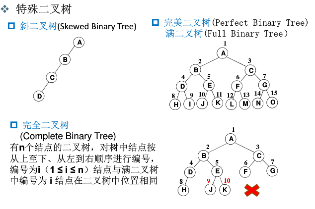

# 树
一个`n`个结点的树有`n-1`条边

n=0,为空树

`n`个结点的判定树的深度为`[log2n] + 1`

## 相关术语
|术语|备注|
|:--:|:--:|
|结点的度|结点的子树个数|
|树的度|树的所有结点中最大的度数|
|叶结点|`度为0`的结点|
|父结点|有子树的结点|
|子结点|A为B的父结点，则B为A的子结点|
|兄弟结点|具有同一父结点的各个结点|
|路径和路径长度|从结点A到Bd的路径为一个序列,路径所包含的边即为路径的长度|
|树的深度|树中结点的最大层次|

# 二叉树
## 特殊二叉树

## 二叉树性质

## 二叉树操作
- 判空
- 遍历（递归实现）
>优化： 使用堆栈把递归变成非递归
  - 先序：根-左子树-右子树
  - 中序：左子树-根-右子树
  - 后序：左子树-右子树-根
>优化： 使用队列把递归变成非递归
  - 层次：从上到下，从左到右
- 创建
# 数组实现（完全二叉树-空间浪费）

# 链表（`推荐`）
## 题目木
1. 输出所有叶子结点
2. 二叉树的高度
3. 二元表达式