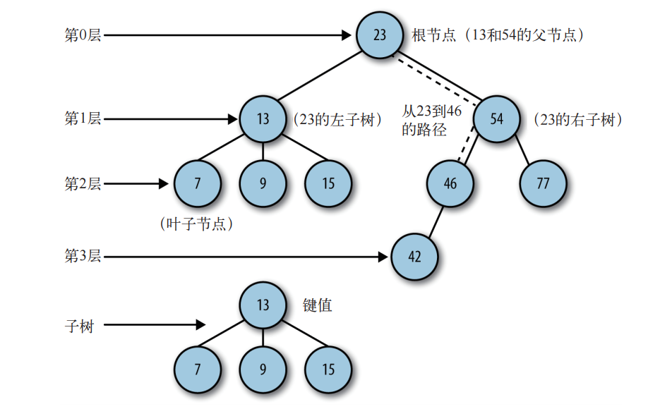
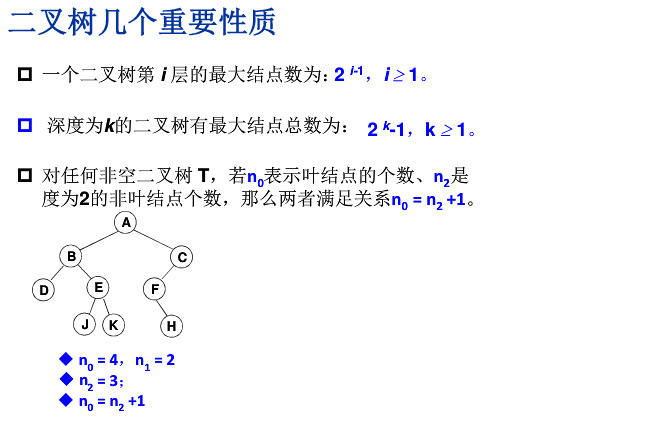

# 树
>高效的插入删除以及查找


## 相关术语
|术语|备注|
|:--:|:--:|
|结点的度|结点的子树个数|
|树的度|树的所有结点中最大的度数|
|叶结点|`度为0`的结点|
|父结点|有子树的结点|
|子结点|A为B的父结点，则B为A的子结点|
|兄弟结点|具有同一父结点的各个结点|
|路径和路径长度|从结点A到Bd的路径为一个序列,路径所包含的边即为路径的长度|
|树的深度|树中结点的最大层次|

一个`n`个结点的树有`n-1`条边

n=0,为空树

`n`个结点的判定树的深度为`[log2n] + 1`
# 二叉树

## 二叉树性质

## 二叉树操作
- 遍历（递归实现）
>优化： 使用堆栈把递归变成非递归
  - 先序：根-左子树-右子树
  - 中序：左子树-根-右子树
  - 后序：左子树-右子树-根
>优化： 使用队列把递归变成非递归
  - 层次：从上到下，从左到右


# 链表实现BST(二叉查找树)

```javascript
/**
*树的结点类
*/
function treeNode (data, left, right){
  this.data = data;
  this.left = left;
  this.right = right;
}

/**
* 二叉查找树类
* 初始根结点指向null，创建一个空结点
*/
function BinarySearchTree (){
  this.root = null; 
  this.insert = insert; // 插入
  this.Porder = Porder; // 先序遍历
  this.inorder = inorder; // 中序遍历
  this.Lorder = Lorder; // 后序遍历
  this.find = find; // 查找
  this.remove = remove; // 删除
}

/**
* 插入，为传入的data创建一个树结点
* 1. 根结点为null，新结点为根结点
* 2. 用一个变量存储当前结点，循环遍历
* 3. 插入的数据小于当前结点，设置当前结点为原结点的左结点（大于设为右结点）
* 4. 当前左结点为null，插入并退出，否则进入下一次循环
*/
function insert (data){
  var n =  new treeNode(data, null, null);
  if(this.root == null){
    this.root = n;
  }else {
    var current = this.root;
    var parent;
    while (true){
      parent = current;
      if(data < current.data){
        current = current.left;
        if(current == null){
          parent.left = n;
          break;
        }
      }else {
        current = current.right;
        if(current == null){
          parent.right = n;
          break;
        }
      }
    }
  }
}

/**
* 先序遍历
* 根-左子树-右子树
*/
function Porder(node){
  if(node){
    console.log(node.data)
    Porder(node.left)
    Porder(node.right)
  }
}

/**
* 中序遍历
* 左子树和-根-右子树
*/
function inorder (node){
  if(node){
    inorder (node.left)
    console.log(node.data)
    inorder(node.right)  
  }
}

/**
* 后序遍历
* 左子树-右子树-根
*/
function Lorder (node){
  if(node){
    Lorder(node.left)
    Lorder(node.right)
    console.log(node.data+" ")
  }
}

/**
* 查找
* 1. 从根结点出发，小的往左大的往右
* 2. 最小值： 最后一个左子树
* 3. 最大值： 最后一个右子树
*/
function find (type, x){
  var current = this.root;
  if(type == null){
    while(current != null){
      if(current.data > x){
        current = current.left;
      }else if(current.data < x){
        current = current.right;
      }else {
        return current;
      }
    }
  }else if(type == 'min'){
    while(current.left != null){
      current = current.left;
    }
    return current.data;
  }else if(type == 'max'){
    while (current.right != null){
      current = current.right;
    }
    return current.data;
  }
}

/**
* 删除
* 1. 根节点开始，判断是否含有待删除数据，没有则继续遍历（小往左大往右），直到找到待删除节点
* 2. 没有子节点： 将父节点指向他的节点指向null
* 3. 只有一个节点： 使其父节点指向其子节点
* 4. 两个子节点：
*  4.1 查找待删除节点左（右）子树上的最大（小）值
*  4.2 用找到的值创建一个临时节点,将临时值赋给待删除节点再删除临时节点
*/
function remove (data){
  root = removeNode(this.root, data);
}

function removeNode (node, data){
  if(node){ // 判空
    if(node.data == data){
      if(node.left == null && node.right == null){// 没有子节点
        return null;
      }else if(node.left == null){// 只有右节点
        return node.right;
      }else if (node.right == null){// 只有左节点
        return node.left;
      }else { // 有两个节点
        var tempNode = find('min', node.right);
        node.data = tempNode.data;
        node.right = removeNode(node.right, tempNode.data);
        return node;
      }
    }else if (data < node.data) {
      node.left = removeNode(node.left, data);
      return node;
    }else {
      node.right = removeNode(node.right, data);
      return node;
    }
  }
}
var bst = new BinarySearchTree();
bst.insert(12)
bst.insert(10)
bst.insert(11)
bst.insert(32)
bst.insert(26)
bst.inorder(bst.root) // 10 11 12 26 32
```
## 题目
1. 输出所有叶子结点
2. 二叉树的高度
3. 二元表达式