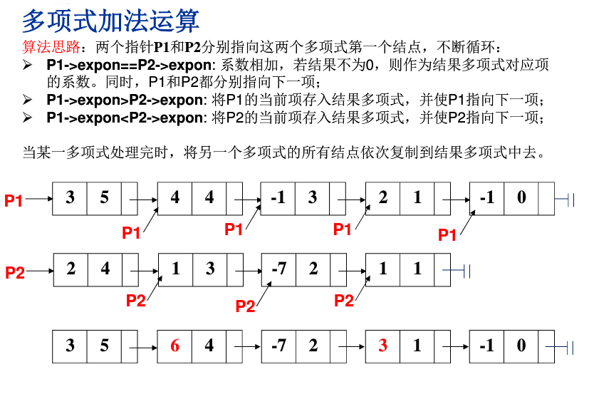

# 数据结构入门
# 复杂度规模表(从小到大)
.png)

`for`: 循环次数 X 循环体复杂度

`if-else`: 取分支中最大的复杂度

## eg.1 打印一个正整数N
```javascript
//方法一：循环
function PrintN (n){
  for (var i = 0; i < n; i++){
    console.log(i+1);
  }
} 
//方法二： 递归
function PrintN (n){
  if (n){
    console.log(n);
    PrintN(n-1);
  }
} 
```
## eg.2 连续多项式求值（系数p、常数数组arr、变量x）
* 常数数组长度要等于系数+1 *
```javascript
// 方法一： 暴力被鄙视
function PolySum (p, arr, x){
  sum = arr[0]; 
  for (var i = 1; i<=p ; i++){
    sum = sum + arr[i]*Math.pow(x, i)
  }
  return sum;
}
// 方法二： 秦九韶
function PolySum (p, arr, x){
  sum = arr[p]; 
  for (var i = p; i>0 ; i--){
    sum = arr[i-1] + x*sum;
  }
  return sum;
}
```
## eg.3 二分查找
`有序数组`arr和待查找数num,找到num在arr中的下标，没有则返回-1.

`left`的更新取`mid+1`；

`right`的更新取`mid-1`；
```javascript
function HalfScan (arr, num){
  var l = 0;
  var r = arr.length-1;
  for (var i = 0; i<arr.length -1 ; i++){
    var m = Math.round((l+r)/2)
    if ( arr[m] < num ){
      l = m+1 ;
    }else if ( arr[m] > num){
      r = m-1;
    }else {
      return m;
    }
  }
  console.log(`搜索结束，没找到`)
}
```
## eg.4 最大子列和（在线处理）
*给定一组数，求出其中连续最大值*
```javascript

// 方法一： 暴力
function MaxSub(arr){
  var max = 0;
  for ( var i = 0 ; i<arr.length; i++){// i是子列左端
    var current = 0;
    for( var j = i; j<arr.length; j++){// j是子列右端
      current = current + arr[j]
      if (current > max){
        max = current;
      }
    }
  }
  return max;
}
// 方法二： 在线处理
function MaxSub(arr){
  var current = 0;
  var max = 0;
  for ( var i = 0 ; i<arr.length; i++){
    console.log(i,current,max)
    current = current + arr[i];
    if(current > max){
      max = current;
    }else if( current<0){
      current = 0;// 只适合最大子列和为正数
    }
  }
  return max;
}
```
## eg.5 多项式求和

