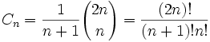

# 堆栈
后入先出`Last In First Out`

只在栈顶进行插入或删除
# 栈的实现
## 1. 数组
```javascript
function Stack (){
  this.top = 0;
  this.data = [];
  this.push = push;
  this.pop = pop;
}
/**
* 入栈
* 栈顶指针+1，插入
*/
function push (x){
  this.top ++;
  if(this.top<=3){
    this.data.push(x)
  }else {
    this.top --;
    alert('满了小兄弟')
  }
}

/**
* 出栈
* 栈顶指针-1，判空
*/
function pop (){
  this.top --;
  if(this.top>=0){
    this.data.pop();
  }else {
    this.top++;
    alert('空了呀')
  }
}
var s = new Stack();
s.push(12)
s.push(23)
s.push(56)
```
## 2. 链表（链栈）
```javascript
function Node (element){
  this.element = element;
  this.next = null;
}
function StackList (){
  this.stack = new Node('stack');
  this.push = push;
  this.pop = pop;
}

/**
* 入栈
* 创建新节点，在stack后插入
*/
function push (x){
  var current = this.stack;
  var temp = new Node(x);
  temp.next = current.next;
  current.next = temp;
}

/**
* 出栈
* 删除stack节点后一节点，stack.next指向null时判空
*/
function pop (){
  var current = this.stack;
  if(current.next == null){
    console.log(`链栈已空`)
  }else {
    var p = current.next.element;
    current.next = current.next.next;
    return p;
  }
}

var sl = new StackList();
sl.push(12)
sl.pop()
```
# 堆栈的应用
## 1. 表达式
- ## 中缀
> (3 + 4) × 5 - 6

操作符以中缀形式处于操作数的中间

- ## 前缀
> \- × + 3 4 5 6

1. 从右至左扫描，将6、5、4、3压入堆栈；
2. 遇到+运算符，因此弹出3和4（3为栈顶元素，4为次顶元素，注意与后缀表达式做比较），计算出3+4的值，得7，再将7入栈；
3. 接下来是×运算符，因此弹出7和5，计算出7×5=35，将35入栈；
4. 最后是-运算符，计算出35-6的值，即29，由此得出最终结果。

- ## 后缀(`计算机`)
>3 4 + 5 × 6 -


## 2. 递归+深度优先搜索+回溯算法（老鼠迷宫）

# 栈的应用
## 1. 数制转换
> 数制转换：将余数入栈，将整除数继续求余数知道整除数为0，最后将栈内元素全部弹出
```javascript
var sl = new StackList();
function NumChange (num, base){
  while(num>0){
    sl.push(num%base)
    num = Math.floor(num/base)
  }
  var result = '';
  while(sl.stack.next){
    result = result + sl.pop()
  }
  return result;
}
```
## 2. 回文判断
>先将字符串拆成单个字符，按序入栈，然后全部出栈，若出入栈顺序相同即为回文
```javascript
  var sl = new StackList();
  function Same(word) {
    for (var i = 0; i < word.length; i++) {
      sl.push(word[i]);
    }
    var rword = "";
    for (var i = 0; i < word.length; i++) {
      var rword = rword+sl.pop();
    }
    if(word == rword){
      return true
    }else {
      return false
    }
  }
```
## `eg.1` 给定ABCD的入栈顺序，求出有几种出栈可能。
- 运用卡特兰数： ，可求出给定顺序的出栈可能。
- `答案`：可能的有8!/ (5!*4!) = `14种`，不可能的有4!- 14 = `10种`

## `eg.2` 一个数组放两个堆栈
从数组两头向中间生长,当两个栈的指针相遇时，两个栈就都满了。
