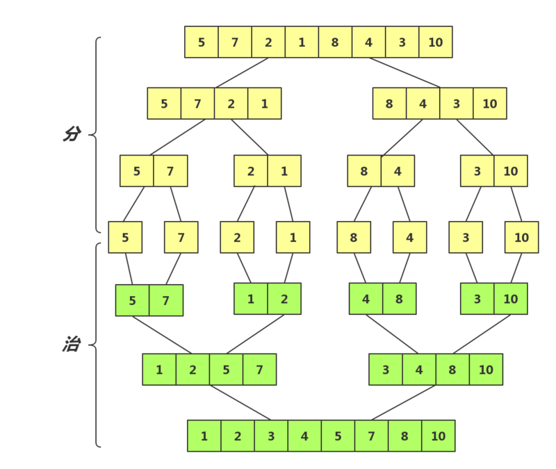
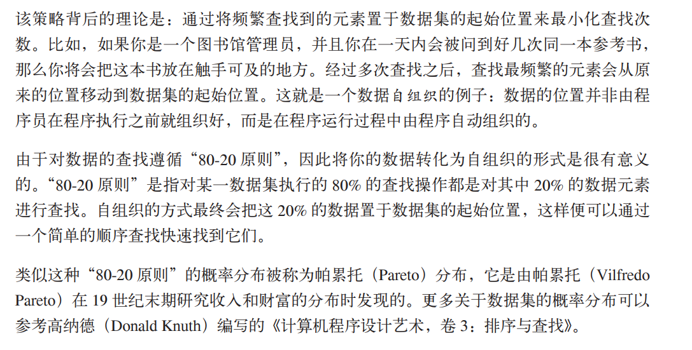

- [排序](#排序)
  - [说明](#说明)
  - [1. 基本排序](#1-基本排序)
  - [2. 高级排序（大数据）](#2-高级排序大数据)
- [查找](#查找)
- [高级算法](#高级算法)
  - [动态规划](#动态规划)
    - [斐波那契](#斐波那契)
    - [最长公共子串](#最长公共子串)
  - [贪心算法](#贪心算法)

## 排序
### 说明
- 稳定：如果a原本在b前面，而a=b，排序之后a仍然在b的前面；
- 不稳定：如果a原本在b的前面，而a=b，排序之后a可能会出现在b的后面；
- 内排序：所有排序操作都在内存中完成；
- 外排序：由于数据太大，因此把数据放在磁盘中，而排序通过磁盘和内存的数据传输才能进行；

- 时间复杂度: 一个算法执行所耗费的时间。
- 空间复杂度: 运行完一个程序所需内存的大小。

## 1. 基本排序
- ### 冒泡排序
比较相邻的两个元素，如果前一个比后一个大，则交换位置。
```js
var str = '76 69 64 4 64 73 47 34 65 93 32';
var arr = str.split(' ').map((i)=>parseInt(i));
// var arr =[]
// for(var i=0; i<10; i++){
//   arr.push(Math.floor(Math.random()*100));
// }
// console.log(arr)
function bubbleSort(arr) {
  console.time()
  for(var i = 0; i<arr.length-2; i++){
    for(var j = i+1; j<arr.length-1; j++){
      if(arr[i] > arr[j]){
        [arr[i], arr[j]] = [arr[j], arr[i]]// es6 交换
      }
    }
  }
  console.timeEnd()
  return arr;
}
bubbleSort(arr);
```
- ### 选择排序
首先在未排序序列中找到最小元素，存放到排序序列的起始位置，然后，再从剩余未排序元素中继续寻找最小元素，然后放到已排序序列的末尾。以此类推，直到所有元素均排序完毕。
```js
function selectSort(arr) {
  console.time()
  for(var i = 0; i<arr.length-2; i++){
    var min = i;
    for(var j = i+1; j<arr.length-1; j++){
      if(arr[min] > arr[j]){
        min = j;
      }
    }
    [arr[i],arr[min]]=[arr[min], arr[i]];
  }
  console.timeEnd()
  return arr;
}
selectSort(arr);
```
- ### 插入排序
插入排序有两个循环。 外循环将数组元素挨个移动， 而内循环则对外循环中选中的元素及它后面的那个元素进行比较。 如果外循环中选中的元素比内循环中选中的元素小，那么数组元素会向右移动， 为内循环中的这个元素腾出位置。
```js
function insertSort(arr){
  console.time()
  for (var i=0; i<arr.length;i++){
    var temp = arr[i];
    var j = i;
    while(j>0 && arr[j-1]>temp){
      arr[j] = arr[j-1];
      j--;
    }
    arr[j] = temp;
  }
  console.timeEnd()
  return arr;
}
insertSort(arr);
```
## 2. 高级排序（大数据）
- ### 希尔排序
在插入排序的基础上做了改善，通过定义一个间隔序列来表示在排序过程中进行比较的元素之
间有多远的间隔，使离正确位置很远的元素更快地回到合适的位置。
```js
function shellSort(arr){
  console.time()
  var g = 1;
  while(g < arr.length/3){// 动态定义间隔序列
    g = 3*g +1;
  }
  while(g>=1){//  插入排序
    for(var i=g; i<arr.length; i++){
      var temp = arr[i];
      var j = i;
      while(j>0 && arr[j-g]>temp){
        arr[j] = arr[j-g];
        --j;
      }
    }
    g = (g-1)/3;
  }
  console.timeEnd()
  return arr;
}
shellSort(arr);
```
- ### 归并排序(消耗大量空间)
js里不适合用递归实现，这个算法递归深度很深2^(n-1)。

自低向上的归并排序
```js
function merge(left, right){
  var temp = [];
  while(left.length && right.length){
    if(left[0]>right[0]){
      temp.push(right.shift())
    }else {
      temp.push(left.shift())
    }
  }
  return temp.concat(left,right);
}
function mergeSort(arr){
  if(arr.length<=1){
    return arr;
  }
  var mid = Math.floor(arr.length/2);
  var left = arr.slice(0, mid);
  var right = arr.slice(mid);
  return merge(mergeSort(left),mergeSort(right))
}
mergeSort(arr);
```

- ### 快速排序(适合多而乱的数组，最快之一)
选择一个基准值，将数组分割为两个子序列；小于基准值放于前，大于放于后；重复子序列(`空则停止`)。
```js
function qSort(arr){
  if (arr.length == 0) {
    return [];
  }
  var base = arr[0];
  var left = [];
  var right = [];
  for (var i =1; i<arr.length; i++){
    arr[i]>base ? right.push(arr[i]) : left.push(arr[i]);
  }
  return qSort(left).concat(base,qSort(right))
}
qSort(arr);
```
## 查找
- ### 自组织顺序查找
频繁查找的放到最前
;
```js
function seqSearch(arr, target){
  for(var i=0; i<arr.length; i++){
    if(arr[i]==target){
      if(i>arr.length*0.2){
        var temp = i;
        [ arr[temp], arr[0] ] = [arr[0], arr[temp]]
      }
      return i;
    }
  }
  console.log(`没找到`)
}
```

- ### 二分查找(先排好序)
二分查找，可以引申出查找重复出现的数字次数:假如数组有重复数字，则二分查找找到的是中间那个值，如[3,3,3],返回的值为1.因此计算重复次数可以先从下标1往左，遇到值为3次数加一，没有就break;之后往右，遇到相同次数加一，没有break
```js
function binSearch (arr, x){
  var l = 0;
  var r = arr.length-1;
  while (l <= r){
    m = Math.round((l+r)/2);
    if( arr[m] > x){
      r = m -1;
    }else if( arr[m] < x){
      l = m+1;
    }else {
      return m;
    }
  }
  console.log(`搜索结束，并未找到`)
}
```
## 高级算法
- ### 动态规划
  >使用递归方案能解决的问题，都能够使用动态规划技巧来解决，而且还能够提高程序的执行效率。

  动态规划设计的算法从它能解决的最简单的子问题开始， 继而通过得到的解， 去解决其他更复杂的子问题， 直到整个问题都被解决。 所有子问题的解通常被存储在一个数组里以便于访问。
  1. 实现斐波那契数列
  - 创建一个长度为n的空数组
  - 从a[2]开始循环赋值到a[n],a[n]即为解。
  ```js
  function dynFib(n){
    if(n<=2){
      return 1;
    }else {
      var result = Array(n);
      result[0] = 1;
      result[1] = 1;
      for(var i = 2; i<n; i++){
        result[i] = result[i-1] + result[i-2];// 赋值
      }
      return result[n-1];
    }
  }
  console.time();
  console.log(dynFib(300));//  0.2119140625ms快的一批
  console.timeEnd()
  ```
  2. 寻找最长公共子串  [理解](https://segmentfault.com/a/1190000007963594)
  ```js
  function dynLCS(str1, str2){
    var lcsarr = [];
    var max = 0;
    var ans = [];
    var x = 0, y = 0;

    // 1. 创建二维数组-空
    for(var i = 0; i<str1.length; i++){
      lcsarr[i] = new Array(str2.length)
    };
    // 2. 相等状态下其左上角不存在则赋值为1，否则等于所有左上角相加之和,便于找出最长的子串
    for(var i = 0; i<str1.length; i++){
      for(var j =0; j<str2.length; j++){
        if(str1[i]!= str2[j]){
          lcsarr[i][j] = 0;
        }else {
          if(i-1<0 || j-1<0){
            lcsarr[i][j] = 1;
          }else{
            lcsarr[i][j] = lcsarr[i-1][j-1]+1;
          }
          if(max < lcsarr[i][j]){// 获取最大值的坐标
            max = lcsarr[i][j];
            x = i;
            y = j;
          }
        }
      }
    };
    console.log(lcsarr);
    // 3. 倒序输出结果
    while(lcsarr[x][y] != 0){
      ans.push(str1[x]);
      console.log(x,y)
      x--;
      y--;
      if(x<0||y<0){
        break;
      }
    }
    return ans.reverse().join('');
  }
  dynLCS('abcdefg','xyzabcd');//  "abcd"
  /*
  0: (7) [0, 0, 0, 1, 0, 0, 0]
  1: (7) [0, 0, 0, 0, 2, 0, 0]
  2: (7) [0, 0, 0, 0, 0, 3, 0]
  3: (7) [0, 0, 0, 0, 0, 0, 4]
  4: (7) [0, 0, 0, 0, 0, 0, 0]
  5: (7) [0, 0, 0, 0, 0, 0, 0]
  6: (7) [0, 0, 0, 0, 0, 0, 0]
  */
  ```
- ### 贪心算法(最优解)
