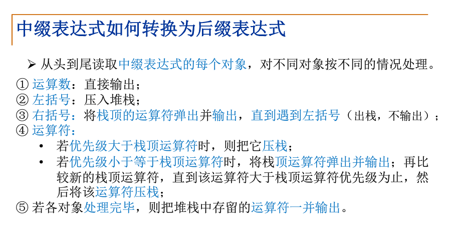
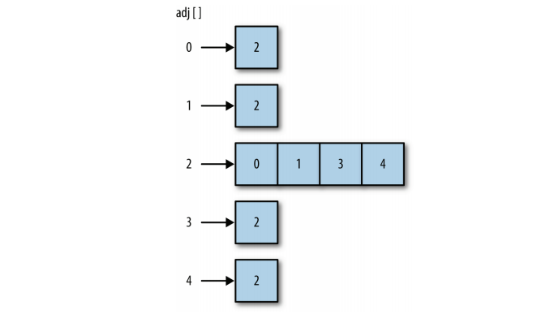
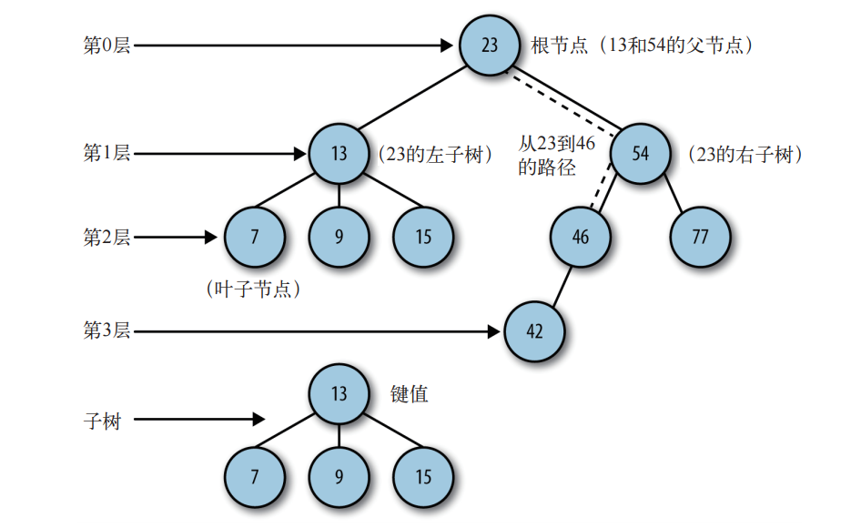
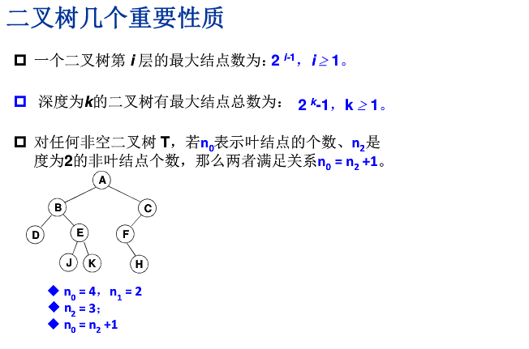

- [数组](#数组)
  - [一.存取函数](#一存取函数)
  - [二.可变函数](#二可变函数修改原数组)
  - [三.迭代器方法](#三.迭代器方法)

- [栈](#栈last-in-first-out)
  - [1. 栈的实现](#1-栈的实现)
  - [2. 栈的应用](#2-栈的应用)
  - [Tips](#Tips)
- [队列](#队列first-in-first-out)
- [链表](#链表)
  - [单向链表](#单向链表)
  - [循环链表](#循环链表)
- [哈希表HashTable](#哈希表hashtable)
  - [碰撞处理](#碰撞处理)
- [集合Set](#集合set)
- [树](#树)
  - [相关术语](#相关术语)
- [二叉树](#二叉树)
  - [链表实现](#链表实现)
  - [三种遍历](#三种遍历)
## 数组
### 一.存取函数
 1.  查找元素——`indexOf()`
 >用来查找传进来的参数在目标数组中是否存在。
如果目标数组包含该参数,就返回该元素在数组中的索引;如果不包含,就返回 -1。

```js
var num =[56,23,45,7,23];
var p = num.indexOf(23);                    
var p_l = num.lastIndexOf(23)
var not = num.indexOf(222);
console.log(p,p_l,not)// 1,4,-1
```
  2. 字符串--数组
   - 字符串转数组：`split()`

该方法通过一些常见的分隔符,比如分隔单词的空格,将一个字符串分成几部分,并将每部分作为一个元素保存于一个新建的数组中
```js
var sentence = "A B C D F";
var words = sentence.split(" ");
var newword=[];
for (var i = 0;i<words.length;i++) {
  newword[i] = words[i];
}
console.log(newword);//["A","B","C","D","F"]
```
   - 数组转字符串

  `toString()`：返回一个包含数组所有元素的字符串,各元素之间用逗号分隔开。

  `join()`：默认返回一个以逗号隔开的字符串，`join("。")`则以句号隔开,`join("")`则不相隔。


 3.  已有数组创建新数组
  - `concat()`:合并多个数组返回一个`新数组`。
  - `splice()`:从现有数组里截取一个新数组,原数组被截取后而改变。该方法的第一个参数是截取的起始索引,第二个参数是截取的长度
```js
var num123 = [1,2,3];
var num45 = [4,5];
var old_num =num123.concat(num45);
console.log(old_num);//  [1, 2, 3, 4, 5]
console.log(num123);// [1,2,3]
var new_num = old_num.splice(1,3);
console.log(new_num);//  [2, 3, 4]
console.log(old_num);// [1,5]
```

### 二.可变函数（`修改原数组`）
1. 添加元素
 - `push()`:将一个元素添加到数组末尾
 - `unshift()`:将多个元素添加在数组的开头

2. 删除元素
 - `pop()`:删除数组末尾的元素
 - `shift()`:删除数组的第一个元素

3. 从数组中间位置添加和删除元素
 - `splice()`：第一个参数是起始索引,第二个参数是删除的个数（将这一部分以新数组形式截取出去），第三个参数是想要添加进数组的元素
```js
var nums = [1,2,3,100,200,300,400,4,5];
nums.splice(3,4,45);
console.log(nums);//  1,2,3,45,4,5
```
4. 排序
 - `reverse()`:将数组中元素的顺序进行翻转
 - `sort()`:默认按照字典顺序对元素进行排序
 ```js
 var nums = [3,1,2,100,4,200];
 nums.sort();
 console.log(nums);//  [1, 100, 2, 200, 3, 4]
 function compare(num1, num2) {
   return num1 - num2;
  }
 nums.sort(compare);
 console.log(nums);//  [1, 2, 3, 4, 100, 200]
 ```

 ### 三.迭代器方法
 >对数组中的每个元素应用`一个函数`,可以返回一个值、一组值或者一个新数组

 1. 不产生新数组
  >对于数组中的每个元素执行某种操作,要么返回一个值

  - `forEach()`：接受一个函数作为参数,对数组中的每个元素使用该函数
  - `reduce()`:接受一个函数,返回一个值。该方法会从一个累加值开始,不断对累加值和数组中的后续元素调用该函数,直到数组中的最后一个元素,最后返回得到的累加值
   ```js
    function add(runningTotal, currentValue) {
    return runningTotal + currentValue;
    }
    var nums = [1,2,3,4,5,6,7,8,9,10];
    var sum = nums.reduce(add);
    print(sum); // 显示 55
  ```
 2. 产生新数组
    - `map()`:对数组中的每个元素使用某个函数,返回一个新的`数组`。
    - `filter()`：对数组中的所有元素应用该函数,结果均为 true 时,该方法返回一个包含应用该函数后结果为 true 的元素的新数组

## 栈(`Last In First Out`)
只在栈顶进行插入或删除
## 1. 栈的实现
- ### 数组
```js
function Stack (){
  this.top = 0;
  this.data = [];
  this.push = push;
  this.pop = pop;
}
/**
* 入栈
* 栈顶指针+1，插入
*/
function push (x){
  this.top ++;
  if(this.top<=3){
    this.data.push(x)
  }else {
    this.top --;
    alert('满了小兄弟')
  }
}

/**
* 出栈
* 栈顶指针-1，判空
*/
function pop (){
  this.top --;
  if(this.top>=0){
    this.data.pop();
  }else {
    this.top++;
    alert('空了呀')
  }
}
var s = new Stack();
s.push(12)
s.push(23)
s.push(56)
```
- ### 链表
```js
function Node (element){
  this.element = element;
  this.next = null;
}
function StackList (){
  this.stack = new Node('stack');
  this.push = push;
  this.pop = pop;
}

/**
* 入栈
* 创建新节点，在stack后插入
*/
function push (x){
  var current = this.stack;
  var temp = new Node(x);
  temp.next = current.next;
  current.next = temp;
}

/**
* 出栈
* 删除stack节点后一节点，stack.next指向null时判空
*/
function pop (){
  var current = this.stack;
  if(current.next == null){
    console.log(`链栈已空`)
  }else {
    var p = current.next.element;
    current.next = current.next.next;
    return p;
  }
}

var sl = new StackList();
sl.push(12)
sl.pop()
```
## 2. 栈的应用
- ### 表达式
中缀:(3 + 4) × 5 - 6

前缀: \- × + 3 4 5 6

1. 从右至左扫描，将6、5、4、3压入堆栈；
2. 遇到+运算符，因此弹出3和4（3为栈顶元素，4为次顶元素，注意与后缀表达式做比较），计算出3+4的值，得7，再将7入栈；
3. 接下来是×运算符，因此弹出7和5，计算出7×5=35，将35入栈；
4. 最后是-运算符，计算出35-6的值，即29，由此得出最终结果。

后缀: 3 4 + 5 × 6 -



- ### 数制转换
> 数制转换：将余数入栈，将整除数继续求余数知道整除数为0，最后将栈内元素全部弹出
```js
var sl = new StackList();
function NumChange (num, base){
  while(num>0){
    sl.push(num%base)
    num = Math.floor(num/base)
  }
  var result = '';
  while(sl.stack.next){
    result = result + sl.pop()
  }
  return result;
}
```
- ### 回文判断
>先将字符串拆成单个字符，按序入栈，然后全部出栈，若出入栈顺序相同即为回文
```js
  var sl = new StackList();
  function Same(word) {
    for (var i = 0; i < word.length; i++) {
      sl.push(word[i]);
    }
    var rword = "";
    for (var i = 0; i < word.length; i++) {
      var rword = rword+sl.pop();
    }
    if(word == rword){
      return true
    }else {
      return false
    }
  }
```
- ### Tips
>给定ABCD的入栈顺序，求出有几种出栈可能。

  运用卡特兰数： ，可求出给定顺序的出栈可能。

  `答案`：可能的有8!/ (5!*4!) = `14种`，不可能的有4!- 14 = `10种`

>一个数组放两个堆栈

从数组两头向中间生长,当两个栈的指针相遇时，两个栈就都满了。
<hr/>

## 队列(`First In First Out`)
队头出队，队尾进队
- ### 数组实现
```js 
function Queue (){
  this.data = [];
  this.enqueue = enqueue; //队尾进队
  this.dequeue = dequeue; // 队头出队
  // 双向队列
  this.front_enqueue = front_enqueue; // 队头进队
  this.rear_dequeue = rear_dequeue; // 队尾出队
}
/**
*  队尾进队
*/
function enqueue (x){
  this.data.push(x);
}

/**
*  队头出队
*/
function dequeue (){
  (this.data.length == 0) && console.log(`队列已空`)
  this.data.shift();
}

/**
*  队头进队
*/
function front_enqueue (x){
  this.data.unshift(x);
}

/**
*  队尾出队
*/
function rear_dequeue (){
  (this.data.length == 0)&& console.log(`队列已空`)
  this.data.pop();
}
var q = new Queue();
```

## 链表
- ### 单向链表
```js 
  // 节点类
  function Node (element){
    this.element = element;
    this.next = null;
  }
  // 链表类
  function LinkList (){
    this.head = new Node('head'); // 头节点
    this.findValue = findValue; // 查找 当前/前一 节点
    this.insert = insert; // 在某节点后插入
    this.create = create; // 循环创建
    this.remove = remove; // 删除某个节点
    this.display = display; // 展示链表
  }

  /**
  * 按值查找
  * 从头节点开始，找不到或者还未指向null时向下遍历
  */

  function findValue (x, pre){
    var current = this.head;
    if( pre ){// 查找前一节点
      while( (current.next!=null) && current.next.element != x){
        current = current.next;
      }
    }else { // 查找当前节点
      while ( (current.next != null) && (current.element != x) ){
        current = current.next;
      }
    }
    return current ;
  }

  /**
  *插入
  *先创建一个新节点，找出插入位置,进行插入
  */

  function insert (x, val){
    var nNode = new Node(x);
    var current = this.findValue(val);
    nNode.next = current.next;
    current.next = nNode;
    return this.display()
  }

  /**
  *创建
  *传入一个最大序号k，循环创建节点head->1->...->k->null
  */

  function create (k){
    for(var i = 0; i<k; i++){
      if(i == 0){
        this.insert(1,'head');
      }else {
        this.insert(i+1, i);
      }
    }
    return this.display()
  }

  /**
  *删除
  *查找删除节点的前一节点的位置
  */

  function remove (x){
    var pre = this.findValue(x, true);
    pre.next = pre.next.next;
    return this.display()
  }
  
  /**
  * 展示
  * 从头指针开始遍历,返回head->1->...->null的字符串
  */

  function display (){
    var current = this.head;
    var result = [];
    while(current.next != null){
      result.push(current.element);
      current = current.next;
    }
    if(current.next == null){
      result.push(current.element)
    }
    return result.join('->');
  }

  var L = new LinkList();
  L.create(5);
```

- ### 循环链表
```js
 /**
 * 节点类
 */
 function Node (element){
   this.element = element;
   this.next = null;
 }

 /**
 * 循环链表类
 */
  function CLinkList (){
    this.head = new Node('head');
    this.head.next = this.head; // 头指针指向自己
    this.findValue = findValue; // 查找 当前/前一 节点
    this.insert = insert; // 在某节点后插入
    this.remove = remove;// 找到删除前一节点，然后进行删除
    this.display = display;// 展示
  }

  /**
  * 查找
  * 检查到头节点时退出循环
  */
  function findValue(x, pre){
    var current = this.head;
    if(pre){
      while ( !(current.next == null) && !(current.next.element == x)){
        current = current.next;
      }
    }else {
      while (!(current.next == null) && !(current.element == x)){
        current = current.next;
      }
    }
    return current;
  }

  /**
  * 插入
  */
  function insert (x,val){
    var nNode = new Node(x);
    var current = this.findValue(val);
    nNode.next = current.next;
    current.next = nNode;
  }

  /**
  * 删除
  */
  function remove (x){
    var pre = this.findValue(x, true);
    pre.next = pre.next.next;
  }

  /**
  * 展示
  */
  function display (){
    var current = this.head;
    var result = [];
    while(!(current.next.element == "head")){
      result.push(current.element)
      current = current.next;
    }
    if (current.next.element == "head"){
      result.push(current.element+'->head')
    }
    return result.join('->')
  }
  var CL = new CLinkList();
  CL.insert(1, 'head');
  CL.insert(2, 1);
  CL.insert(3, 2);
  CL.remove(2);
  CL.display();
```
## 哈希表HashTable
键值对 对数组长度取余 质数
### 碰撞处理
如果数组的大小是待存储数据个数的 1.5 倍，那么使用开链法；如果数组的大小是待存储数据的两倍及两倍以上时，那么使用线性探测法。

- ### 开链法
在创建存储散列过的键值的数组时，通过调用一个函数创建一个新的空数组，然后将该数组赋给散列表里的每个数组元素。这样就创建了一个二维数组。

- ### 线性探测法
线性探测法。线性探测法隶属于一种更一般化的散列技术：开放寻址散列。当发生碰撞时，线性探测法检查散列表中的下一个位置是否为空。如果为空，
就将数据存入该位置；如果不为空，则继续检查下一个位置，直到找到一个空的位置为止。该技术是基于这样一个事实：每个散列表都会有很多空的单元格，可以使用它们来存储数据。

## 集合Set
集合中的成员无序且不重复
```js
// 数组去重
var arr = [1,2,3,1,4,5,4]
var result = new Set(arr);
console.log(Array.from(result));// [1, 2, 3, 4, 5]
```
## 树
>高效的插入删除以及查找

### 相关术语
|术语|备注|
|:--:|:--:|
|结点的度|结点的子树个数|
|树的度|树的所有结点中最大的度数|
|叶结点|`度为0`的结点|
|父结点|有子树的结点|
|子结点|A为B的父结点，则B为A的子结点|
|兄弟结点|具有同一父结点的各个结点|
|路径和路径长度|从结点A到Bd的路径为一个序列,路径所包含的边即为路径的长度|
|树的深度|树中结点的最大层次|

一个`n`个结点的树有`n-1`条边

n=0,为空树

`n`个结点的判定树的深度为`[log2n] + 1`

## 二叉树

- ## 二叉树性质


- ### 链表实现
```js
/**
*树的结点类
*/
function treeNode (data, left, right){
  this.data = data;
  this.left = left;
  this.right = right;
}

/**
* 二叉查找树类
* 初始根结点指向null，创建一个空结点
*/
function BinarySearchTree (){
  this.root = null; 
  this.insert = insert; // 插入
  this.Porder = Porder; // 先序遍历
  this.inorder = inorder; // 中序遍历
  this.Lorder = Lorder; // 后序遍历
  this.find = find; // 查找
  this.remove = remove; // 删除
}

/**
* 插入，为传入的data创建一个树结点
* 1. 根结点为null，新结点为根结点
* 2. 用一个变量存储当前结点，循环遍历
* 3. 插入的数据小于当前结点，设置当前结点为原结点的左结点（大于设为右结点）
* 4. 当前左结点为null，插入并退出，否则进入下一次循环
*/
function insert (data){
  var n =  new treeNode(data, null, null);
  if(this.root == null){
    this.root = n;
  }else {
    var current = this.root;
    var parent;
    while (true){
      parent = current;
      if(data < current.data){
        current = current.left;
        if(current == null){
          parent.left = n;
          break;
        }
      }else if(data > current.data){
        current = current.right;
        if(current == null){
          parent.right = n;
          break;
        }
      }else {
        console.log(`相逢`)
        return;
      }
    }
  }
}

/**
* 查找
* 1. 从根结点出发，小的往左大的往右
* 2. 最小值： 最后一个左子树
* 3. 最大值： 最后一个右子树
*/
function find (type, x){
  var current = this.root;
  if(type == null){
    while(current != null){
      if(current.data > x){
        current = current.left;
      }else if(current.data < x){
        current = current.right;
      }else {
        return current;
      }
    }
  }else if(type == 'min'){
    while(current.left != null){
      current = current.left;
    }
    return current.data;
  }else if(type == 'max'){
    while (current.right != null){
      current = current.right;
    }
    return current.data;
  }
}

/**
* 删除
* 1. 根节点开始，判断是否含有待删除数据，没有则继续遍历（小往左大往右），直到找到待删除节点
* 2. 没有子节点： 将父节点指向他的节点指向null
* 3. 只有一个节点： 使其父节点指向其子节点
* 4. 两个子节点：
*  4.1 查找待删除节点左（右）子树上的最大（小）值
*  4.2 用找到的值创建一个临时节点,将临时值赋给待删除节点再删除临时节点
*/
function remove (data){
  root = removeNode(this.root, data);
}

function removeNode (node, data){
  if(node){ // 判空
    if(node.data == data){
      if(node.left == null && node.right == null){// 没有子节点
        return null;
      }else if(node.left == null){// 只有右节点
        return node.right;
      }else if (node.right == null){// 只有左节点
        return node.left;
      }else { // 有两个节点
        var tempNode = find('min', node.right);
        node.data = tempNode.data;
        node.right = removeNode(node.right, tempNode.data);
        return node;
      }
    }else if (data < node.data) {
      node.left = removeNode(node.left, data);
      return node;
    }else {
      node.right = removeNode(node.right, data);
      return node;
    }
  }
}
var bst = new BinarySearchTree();
bst.insert(12)
bst.insert(10)
bst.insert(11)
bst.insert(32)
bst.insert(26)
```
- ### 三种遍历
```js
/**
* 先序遍历
* 根-左子树-右子树
*/
function Porder(node){
  if(node){
    console.log(node.data)
    Porder(node.left)
    Porder(node.right)
  }
}

/**
* 中序遍历
* 左子树和-根-右子树
*/
function inorder (node){
  if(node){
    inorder (node.left)
    console.log(node.data)
    inorder(node.right)  
  }
}

/**
* 后序遍历
* 左子树-右子树-根
*/
function Lorder (node){
  if(node){
    Lorder(node.left)
    Lorder(node.right)
    console.log(node.data+" ")
  }
}
bst.inorder(bst.root) // 10 11 12 26 32
```
