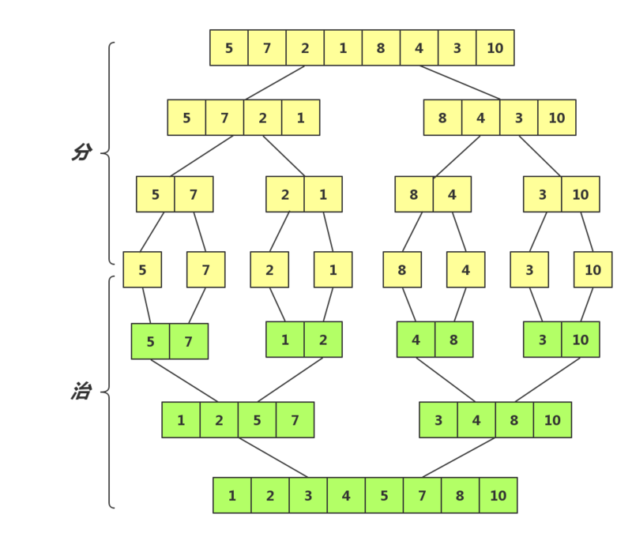
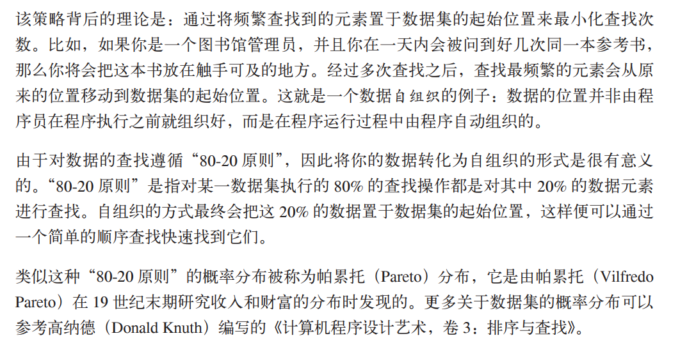

# 排序
## 说明
- 稳定：如果a原本在b前面，而a=b，排序之后a仍然在b的前面；
- 不稳定：如果a原本在b的前面，而a=b，排序之后a可能会出现在b的后面；
- 内排序：所有排序操作都在内存中完成；
- 外排序：由于数据太大，因此把数据放在磁盘中，而排序通过磁盘和内存的数据传输才能进行；

- 时间复杂度: 一个算法执行所耗费的时间。
- 空间复杂度: 运行完一个程序所需内存的大小。

## 1. 基本排序
- ### 冒泡排序
比较相邻的两个元素，如果前一个比后一个大，则交换位置。
```js
var str = '76 69 64 4 64 73 47 34 65 93 32';
var arr = str.split(' ').map((i)=>parseInt(i));

var arr =[]
for(var i=0; i<10; i++){
  arr.push(Math.floor(Math.random()*100));
}
console.log(arr)

function bubbleSort(arr) {
  console.time()
  for(var i = 0; i<arr.length-2; i++){
    for(var j = i+1; j<arr.length-1; j++){
      if(arr[i] > arr[j]){
        [arr[i], arr[j]] = [arr[j], arr[i]]// es6 交换
      }
    }
  }
  console.timeEnd()
  return arr;
}
bubbleSort(arr);
```
- ### 选择排序
首先在未排序序列中找到最小元素，存放到排序序列的起始位置，然后，再从剩余未排序元素中继续寻找最小元素，然后放到已排序序列的末尾。以此类推，直到所有元素均排序完毕。
```js
function selectSort(arr) {
  console.time()
  for(var i = 0; i<arr.length-2; i++){
    var min = i;
    for(var j = i+1; j<arr.length-1; j++){
      if(arr[min] > arr[j]){
        min = j;
      }
    }
    [arr[i],arr[min]]=[arr[min], arr[i]];
  }
  console.timeEnd()
  return arr;
}
selectSort(arr);
```
- ### 插入排序
插入排序有两个循环。 外循环将数组元素挨个移动， 而内循环则对外循环中选中的元素及它后面的那个元素进行比较。 如果外循环中选中的元素比内循环中选中的元素小，那么数组元素会向右移动， 为内循环中的这个元素腾出位置。
```js
function insertSort(arr){
  console.time()
  for (var i=0; i<arr.length;i++){
    var temp = arr[i];
    var j = i;
    while(j>0 && arr[j-1]>temp){
      arr[j] = arr[j-1];
      j--;
    }
    arr[j] = temp;
  }
  console.timeEnd()
  return arr;
}
insertSort(arr);
```
## 2. 高级排序（大数据）
- ### 希尔排序
在插入排序的基础上做了改善，通过定义一个间隔序列来表示在排序过程中进行比较的元素之
间有多远的间隔，使离正确位置很远的元素更快地回到合适的位置。
```js
function shellSort(arr){
  console.time()
  var g = 1;
  while(g < arr.length/3){// 动态定义间隔序列
    g = 3*g +1;
  }
  while(g>=1){//  插入排序
    for(var i=g; i<arr.length; i++){
      var temp = arr[i];
      var j = i;
      while(j>0 && arr[j-g]>temp){
        arr[j] = arr[j-g];
        --j;
      }
    }
    g = (g-1)/3;
  }
  console.timeEnd()
  return arr;
}
shellSort(arr);
```
- ### 归并排序(消耗大量空间)
js里不适合用递归实现，这个算法递归深度很深2^(n-1)。

自低向上的归并排序
```js
function merge(left, right){
  var temp = [];
  while(left.length && right.length){
    if(left[0]>right[0]){
      temp.push(right.shift())
    }else {
      temp.push(left.shift())
    }
  }
  return temp.concat(left,right);
}
function mergeSort(arr){
  if(arr.length<=1){
    return arr;
  }
  var mid = Math.floor(arr.length/2);
  var left = arr.slice(0, mid);
  var right = arr.slice(mid);
  return merge(mergeSort(left),mergeSort(right))
}
mergeSort(arr);
```

- ### 快速排序(适合多而乱的数组，最快之一)
选择一个基准值，将数组分割为两个子序列；小于基准值放于前，大于放于后；重复子序列(`空则停止`)。
```js
function qSort(arr){
  if (arr.length == 0) {
    return [];
  }
  var base = arr[0];
  var left = [];
  var right = [];
  for (var i =1; i<arr.length; i++){
    arr[i]>base ? right.push(arr[i]) : left.push(arr[i]);
  }
  return qSort(left).concat(base,qSort(right))
}
qSort(arr);
```
## 查找
- ### 自组织顺序查找
频繁查找的放到最前
;
```js
function seqSearch(arr, target){
  for(var i=0; i<arr.length; i++){
    if(arr[i]==target){
      if(i>arr.length*0.2){
        var temp = i;
        [ arr[temp], arr[0] ] = [arr[0], arr[temp]]
      }
      return i;
    }
  }
  console.log(`没找到`)
}
```

- ### 二分查找(先排好序)
二分查找，可以引申出查找重复出现的数字次数:假如数组有重复数字，则二分查找找到的是中间那个值，如[3,3,3],返回的值为1.因此计算重复次数可以先从下标1往左，遇到值为3次数加一，没有就break;之后往右，遇到相同次数加一，没有break
```js
function binSearch (arr, x){
  var l = 0;
  var r = arr.length-1;
  while (l <= r){
    m = Math.round((l+r)/2);
    if( arr[m] > x){
      r = m -1;
    }else if( arr[m] < x){
      l = m+1;
    }else {
      return m;
    }
  }
  console.log(`搜索结束，并未找到`)
}
```
## 高级算法
- ### 动态规划
  使用递归方案能解决的问题，都能够使用动态规划技巧来解决，而且还能够提高程序的执行效率。
- ### 贪心算法