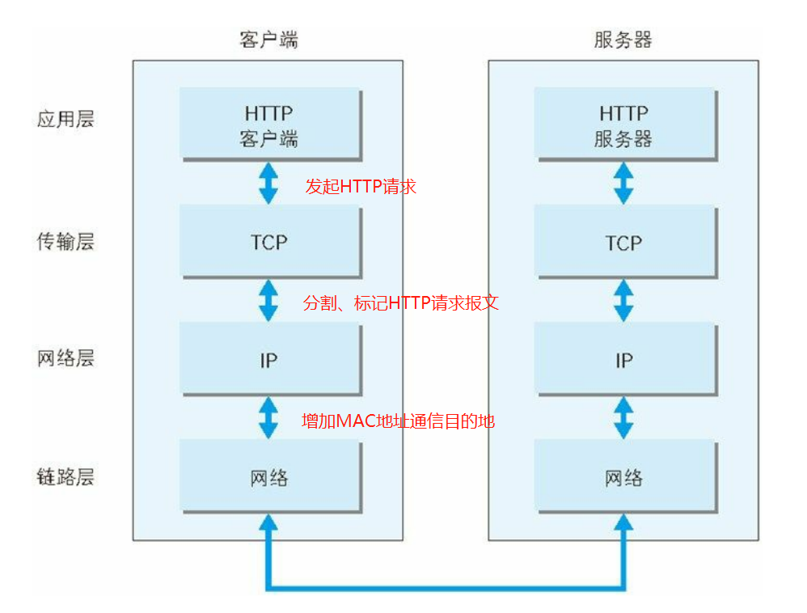
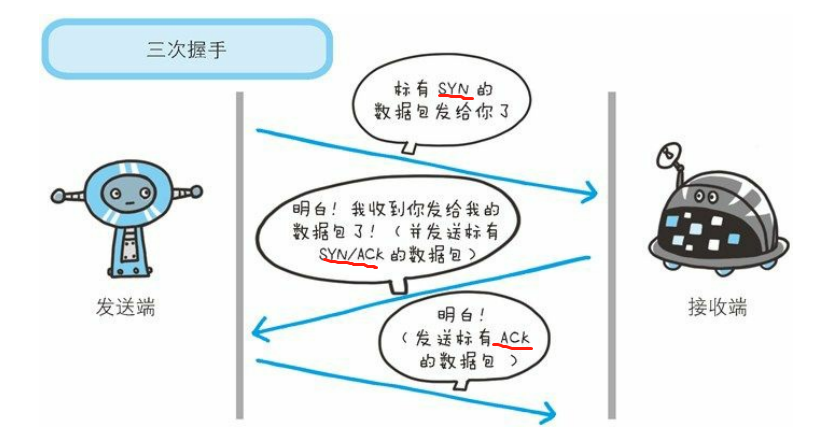
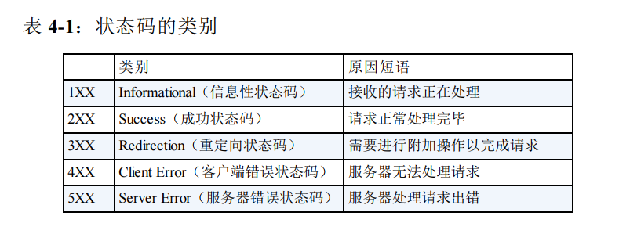
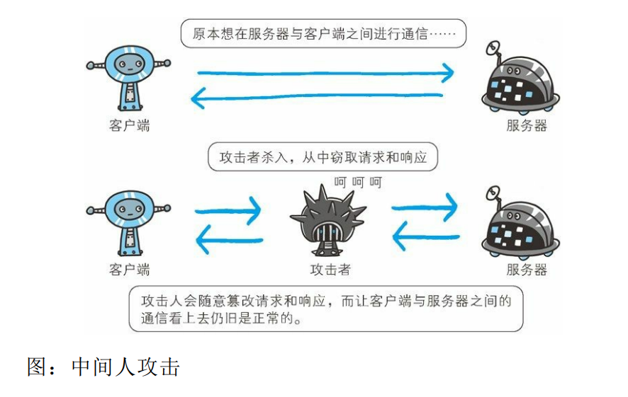

# 一.HTTP
`客户端`:通过发送请求获取服务器资源的 Web 浏览器等.

`HTTP`:HyperText Transfer Protocol,超文本传输协议

`URL`:Uniform12Resource Locator,统一资源定位符

`TCP/IP `:互联网相关的各类协议族的总称

## TCP/IP 
### 1.分层
- `应用层` 
   决定了向用户提供应用服务时通信的活动,如HTTP、FTP协议、DNS服务、

- `传输层`
	提供处于网络连接中的两台计算机之间的数据传输。TCP、UDP协议

- `网络层`
	处理在网络上流动的数据包。数据包是网络传输的最小数据单位。

- `链路层`
	处理连接网络的硬件部分。包括控制操作系统、硬件的设备驱
动、网络适配器,及光纤等物理可见部分

### 2.传输
- 传输流

- 封装

	数据在层与层之间传输时，每经过一层时必定会被打上一个该层所属的首部信息，并在接收端逐层消去

### 3. 协议
- IP 协议（传输）

 	位于网络层，利用`IP地址`(可变)和`MAC地址`（网卡固定地址）把各种数据包准确传送给对方，使用`ARP协议`凭借 MAC 地址进行通信。
- TCP协议（确保准确性）

	位于传输层，将大块数据分割成以`报文段`（segment）为单位的数据包进行管理。

	TCP可以采用`三次握手策略`，确保将数据送达目标，若握手过程莫名中断，TCP协议会再次以相同的顺序发送相同的数据包。

- DNS 服务（域名解析）
	
	位于应用层，提供域名到 IP 地址之间的解析服务

### 4.URI和URL
 `URI`:统一资源标识符，表示由某个`协议方案`(http、ftp、file等)表示的资源的定位标识符

 `URL`:统一资源定位符

# 二.HTTP协议
用于客户端和服务器端之间的通信

`客户端`:请求访问文本或图像等资源的一端

`服务器端`:提供资源响应的一端

客户端通过HTTP协议发起`请求报文`（请求方法+请求URI+协议版本+可选的首部字段+内容实体）
，服务器端返回`响应报文`(协议版本+状态码+原因短句+首部字段+空行+实体主体)。

HTTP是`无状态协议`，不保存之前一切请求或响应报文的信息，为了保存状态，引入了`cookie`。

## HTTP方法
- GET(获取资源)：请求访问已被 URI 识别的资源,返回响应内容
- POST(传输实体主体)
- HEAD（获得报文首部：用于确认URI 的有效性及资源更新的日期时间等
- OPTIONS(询问支持的方法):查询针对请求 URI 指定的资源支持的方法
- PUT（传输文件）：要求在请求报文的主体中包含文件内容，然后保存到请求 URI 指定的位置
- DELETE（删除文件):按请求 URI 删除指定的资源
- CONNECT(用隧道协议连接代理):实现用隧道协议进行 TCP 通信。主要使用 SSL(安全套接
层)和 TLS（传输层安全）协议把通信内容加密后经网络隧道传输。

## 使用Cookie进行状态管理
Cookie 会根据响应报文内的Set-Cookie的首部字段信息，通知客户端保存 Cookie。

服务器端发现客户端发送过来的 Cookie 后，会去检查究竟是从哪一个客户端发来的连接请求，然后对比服务器上的记录，最后得到之前的状态信息。

# 三.HTTP报文内的HTTP信息
- 报文结构

 	`报文首部`：需处理的请求或响应的内容及属性

 	`空行`（CR+LF）:换行

 	`报文主体`：应被发送的数据
	 
	`请求行`：包括请求方法，请求 URI 和 HTTP 版本

	`响应行`：状态码，原因短语和 HTTP 版本
	
	`首部字段`：即HTTP首部包括通用首部、请求首部、响应首部和实体首部

- 提高传输效率

	HTTP 报文的主体用于传输请求或响应的实体主体

	一般，报文主体等于实体主体。只有当传输中进行编码操作时，实体主体的内容发生变化，才导致差异。
	1. 编码
	- 压缩传输
	
		保持实体信息原样压缩，由客户端接收并负责解码
	
	- 分块传输
		将实体主体分成多个部分（块）。用16进制来标记块的大小，而实体主体的最后一块会使用“0(CR+LF)”来标记。最终由接收的客户端负责解码
	2. 获取部分内容
	- 范围请求：指定下载的实体范围，用首部字段 `Range` 来指定资源的 byte 范围

	3. 内容协商机制

		以响应资源的语言、字符集、编码方式等作为判断的基准,返回合适内容

# 四.HTTP状态码
当客户端向服务器端发送请求时，描述返回的请求结果

## 1.成功状态码（2XX）
- `200 OK`：请求被正常处理
- `204 No Content`：请求已成功处理，但返回的响应报文中不含实体的主体部分
- `206 Partial Content`：客户端进行了范围请求

## 2.重定向状态码(3XX)
- `301 Moved Permanently`：永久性重定向,请求的资源已被分配了新的 URI，应使用新URI访问资源 
- `302 Found`：临时性重定向。请求的资源已被分配新URI，希望本次使用新URI访问
- `303 See Other`：与302 Found 状态码有着相同的功能，但 303 状态码明确表示采用 GET 方法获取资源
- `304 Not Modified`：客户端发送附带条件的请求，满足条件时允许请求访
问资源，未满足条件时。304 状态码返回不包含任何响应的主体部分。

## 3. 客户端错误(4XX)

- `400 Bad Request`：请求报文中存在语法错误
- `401 Unauthorized`：发送的请求需要有通过 HTTP 认证（BASIC 认证、DIGEST 认证）的认证信息。若之前已进行过 1 次请求，表示认证失败。
- `403 Forbidden`：请求资源的访问被服务器拒绝
- `404 Not Found`：服务器上无法找到请求的资源

## 4.服务器错误(5XX)

- `500 Internal Server Error`：服务器端在执行请求时发生了错误。也有可能是 Web应用存在的 bug 或某些临时的故障
- `503 Service Unavailable`：服务器暂时处于超负载或正在进行停机维护，无法处理请求

# 五.Web服务器

## 1.通信数据转发程序

- 代理

    接收客户端请求并转发给服务器，接收服务器返回响应转发给客户端。转发时追加写入 `Via` 首部信息

优点：利用缓存技术减少网络带宽的流量，组织内部针对特定网站的访问控制，以获取访问日志为主要目的

- 网关

    网关能使通信线路上的服务器提供非 HTTP 协议服务

    优点：可以在客户端与网关之间的通信线路上利用非 HTTP 协议服务加密以确保连接的安全
- 隧道
隧道可按要求建立起一条与其他服务器的通信线路，届时使用 SSL等加密手段进行安全通信

## 2.资源缓存

指代理服务器或客户端本地磁盘内保存的资源副本。可减少对源服务器的访问，节省了通信流量和通信时间。

- 缓存有效期

    向源服务器确认资源的有效性。若判断缓存失效，缓存服务器将会再次从源服务器上获取“新”资源。

## 六.HTTP首部
首部字段可传递额外信息，给浏览器和服务器提供报文主体大小、所使用的语言、认证信息等内容。

HTTP 首部字段重复，不同浏览器优先处理不同次序出现的首部字段。

`字段结构`：首部字段名: 字段值
## 6.1通用首部字段
请求报文和响应报文双方都会使用的首部
### 1.`Cache-Control`

- 控制缓存行为

	`Cache-Control: public`：其他用户也可缓存

	`Cache-Control: private`：特定用户可以缓存

	`Cache-Control: no-cache`：不缓存过期的资源，会确认有效期

	`Cache-Control: no-store`：不进行缓存(请求/响应可能包含机密信息)
	

### 2.`Connection`

- 控制不再转发给代理的首部字段

- 管理持久连接

 	`Connection: close`：断开连接

 	`Connection: Keep-Alive`：持久化连接

### 3.`Date`(创建 HTTP 报文的日期和时间)
### 4.`Transfer-Encoding`：规定传输报文主体时采用的编码方式
### 5.`Upgrade`：检测 HTTP 协议及其他协议是否可使用更高的版本进行通信，参数值可用来指定不同的通信协议。

### 6. `via`：追踪客户端与服务器之间（代理服务器）的请求和响应报文的传输路径

## 6.2请求首部字段
客户端往服务器端,补充请求的附加信息、客户端信息、对响应内容相关的优先级等内容。
### 1.类型及优先级（Accept）
- `Accept`：通知服务器，客户端能够处理的媒体类型及相对优先级

	`Accept: text/plain,image/jpe;q =0.3,text/html`
- `Accept-Charset`：通知服务器，客户端支持的字符集及相对优先顺序
- `Accept-Encoding`：客户端支持的内容编码及优先级顺序
- `Accept-Language`:客户端希望的自然语言集（指中文或英文等）相对优先级
### 2.`Authorization`：告知服务器，客户端的认证信息（证书值）
### 3.`From`：告知服务器使用客户端用户的电子邮件地址址
### 4.`Host`：若相同的 IP 下部署运行多个域名，需要使用首部字段 Host 来明确指出请求的主机名

### 5.条件请求（If-xx）
`If-Range`:告知服务器若指定的 If-Range 字段值（ETag 值或者时间）和请求资源的 ETag 值或时间一致时，则作为范围请求处理。反之，则返回全体资源。
### 6.Max-Forwards

### 7.User-Agent：用于传达浏览器的种类

## 6.2响应首部字段
### 1.`Accept-Ranges：bytes | none `：告知客户端服务器是否可处理范围请求
### 2.`Age`：告知客户端，源服务器在多久前创建了响应（单位：s）
### 3.`ETag`：资源被缓存时，就会被分配唯一性标识,当资源更新时，ETag 值也需要更新。
### 4.`Location`：引导客户端至某个与请求 URI 位置不同的资源。（配合重定向）
### 5.`Proxy-Authenticate`：把由代理服务器所要求的认证信息发送给客户端
### 6.`Retry-After`：告知客户端应该在多久之后再次发送请求(配合503 Service Unavailible)

## 6.3实体首部字段
### 1.`Allow`：通知客户端能够支持 Request-URI 指定资源的所有HTTP方法
### 2.`Content-Encoding`:告知客户端服务器对实体的主体部分选用的内容编码方式(不丢失实体信息的前提)
### 3. `Content-Language`:告知客户端实体主体使用的自然语言（中文、英文）
### 4.`Content-Length`:表明了实体主体部分的大小（单位:字节）。
	对实体主体进行内容编码传输时，不能再使用 Content-Length首部字段
### 5.`Content-Location`：表示的是报文主体返回资源对应的 URI
### 6.`Content-Range`：告知客户端作为响应返回的实体的哪个部分符合范围请求
### 7.`Expires`：将资源失效的日期告知客户端
### 8.Cookie
 - Set-Cookie：响应首部字段，开始状态管理所使用的Cookie信息
	`expires 属性`：指定浏览器可发送 Cookie 的有效期
 - Cookie:请求首部字段，服务器接收的Cookie信息

# HTTPS
## 1.HTTP的缺点

- 通信使用明文，内容可被窃听
- 不验证通信方的身份
	- 任何人可以发起请求，所有人接收响应
	- 无法判定请求是来自哪里
- 无法证明报文的完整性

## 2.HTTTPS
## `HTTP+ 加密 + 认证 + 完整性保护=HTTPS`
HTTPS 并非应用层的新协议。只是 HTTP 通信接口部分用SSL（Secure Socket Layer,安全套接层）和 TLS（Transport Layer Security，安全层传输协议）协议代替而已。
- 采用混合加密机制
- 公开密钥证书

- HTTPS速度较HTTP慢
	1. 通信慢
	2. 占用大量CPU资源，导致处理速度变慢

# 七.用户认证
## 7.1认证信息
- 密码
- 动态令牌(一次性密码)
- 数字证书（用户设备）
- 生物认证（虹膜、指纹）
- IC卡
## 7.2认证方式

1. `BASIC 认证`（基本认证）
- Base64 编码,没有加密
- 浏览器却无法实现认证注销操作

2. `DIGEST 认证`（摘要认证）
- 质询响应方式：发送认证-接收到质询码计算生成响应码-返回响应码

3. `SSL 客户端认证`(证书+密码双认证)
- 双因素认证：证书用来认证客户端计算机,密码则用来确定这是用户本人的行为。
- 证书费用

4. `FormBase 认证`（基于表单认证）

## 7.3 WebSocket协议

Web 浏览器与 Web 服务器之间`全双工通信标准`

不论服务器还是客户端，任意一方都可直接向对方发送报文

在HTTP协议基础上进行握手

- 推送功能：服务器可直接发送数据，不必等待请求。
- 减少通信量：建立起 WebSocket 连接，一直保持连接状态

# 八.常见web攻击技术
对 Web 应用的攻击模式有`主动攻击`和`被动攻击`。
## 主动攻击
通过直接访问Web传入攻击代码，直接针对服务器上的资源进行攻击从而访问资源。
- `SQL注入攻击`

针对 Web 应用使用的数据库，通过运行非法的 SQL而产生的攻击
- OS命令攻击
通过 Web 应用，执行非法的操作系统命令达到攻击的目的

## 被动攻击
利用圈套策略执行攻击代码的攻击模式，不直接对web访问进行攻击
- `XSS`跨站脚本攻击
- `CSRF`跨站点请求伪造
- HTTP 首部注入攻击
