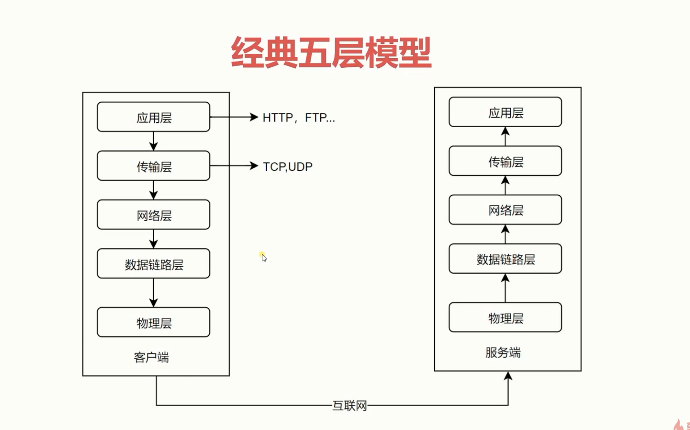
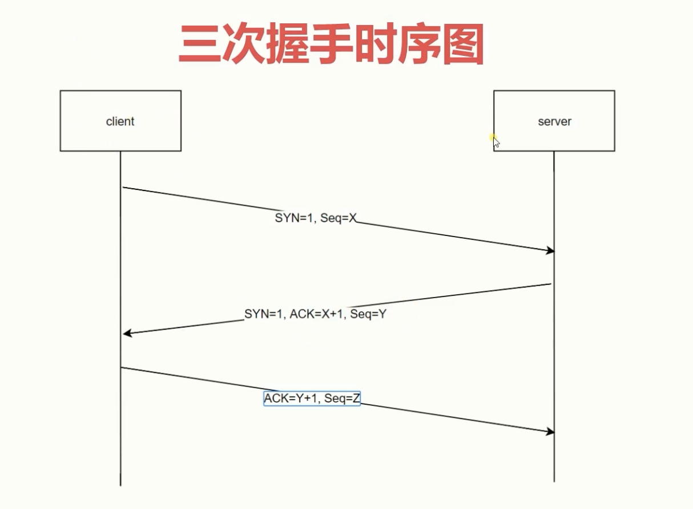
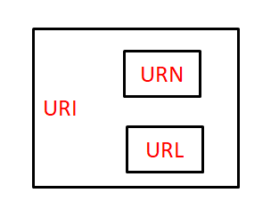
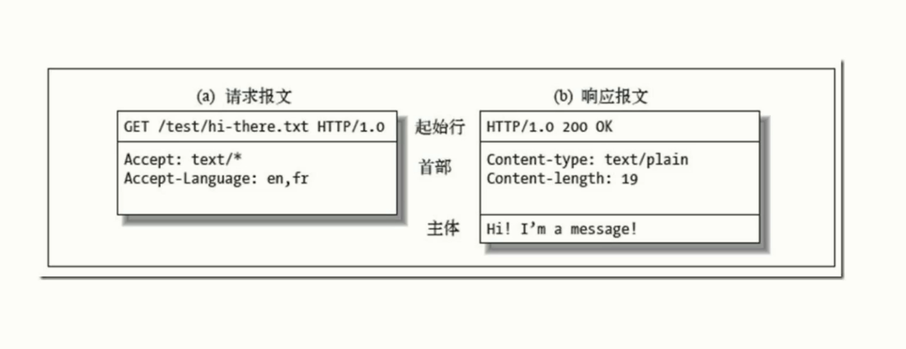

## 基础
### 1. 网络协议分层
- 物理层：定义物理设备(网卡接口、光缆等)如何传输数据，单位是`比特（bit）`。
- 数据链路层：通信实体建立数据链路链接，单位是`帧（frame）`。
- 网络层：数据在结点间传输创建逻辑链路，单位是`包（packet）`，协议有`IP协议`。
- 传输层： 提供处于网络连接中的两台计算机之间的数据传输。如`TCP、UDP协议`。
- 应用层： 决定了向用户提供应用服务时通信的活动,如`HTTP、FTP协议、DNS服务`。

### 2. HTTP协议发展历史
HTTP/0.9
  - 只有`GET`命令
  - 没有HEADER等描述数据的信息
  - 服务器发送完毕`立即关闭TCP连接`

HTTP/1.0
 - 增加很多命令`Post、 Put`等
 - 增加了`status code ` 和 `header`
 - 多字符集支持、权限、缓存等

HTTP/1.1
 - 支持持久连接（如服务器响应后不关闭TCP连接）
 - pipeline，同一个连接可以发起多个请求，但此时服务器只能顺序处理
 - 增加`host`命令，可以在同一个物理服务器跑多个服务

HTTP2
 - 所有数据以二进制传输
 - 同一连接里发送的多个请求不需要按照顺序
 - 头信息压缩以及`推送`(服务端可以主动发起数据传输)以提高效率

### 3. TCP的三次握手
 Ack =seq + 1
- 第一次： 发出连接请求报文段，（首部的同步位SYN=1，初始序号seq=x）

- 第二次： 确认报文段中（SYN=1，ACK=1，确认号ack=x+1，初始序号seq=y）

- `第三次`: 向sever给出确认报文段（ACK=1，确认号ack=y+1，序号seq=x+1）（初始为seq=x，第二个报文段所以要+1），ACK报文段可以携带数据，不携带数据则不消耗序号。TCP连接已经建立，A进入ESTABLISHED（已建立连接）。`防止client由于网络超时关闭，而服务器端处于等待状态,浪费资源。`

[TCP三次握手详解及释放连接过程](https://www.cnblogs.com/laowz/p/6947539.html)

#### 4. URI、URL、URN
- URI：统一资源标识符，
- URL：统一资源定位符，URL也是一种URI，也是一种资源的标识，但它也指明了如何定位Locate到这个资源。如使用http/ftp进行定位
- URN： 永久统一资源定位符，url资源被移位访问报404，而URN仍然可以访问（不成熟的技术）

URL是URI的子集，所有的URL都是URI，但不是每个URI都是URL，还有可能是URN。
#### 4. HTTP报文
4.1 请求报文
- 请求行：由`请求方法字段、URL字段和HTTP协议版本字段`3个字段组成，它们用空格分隔。例如，GET /index.html HTTP/1.1。
- 请求头：由关键字/值对组成，每行一对，关键字和值用英文冒号“:”分隔。请求头部通知服务器有关于客户端请求的信息，例如：
  - User-Agent：产生请求的浏览器类型。
  - Accept：客户端可识别的内容类型列表。
  - Host：请求的主机名，允许多个域名同处一个IP地址，即虚拟主机。
- 空行（CRLF）：发送回车符和换行符，`通知服务器以下不再有请求头`。
- 请求数据：不在GET方法中使用，一般在POST方法中使用。与请求数据相关的最常使用的请求头是`Content-Type`和`Content-Length`。

4.2 响应报文
- 响应首行(状态行)：通过提供一个状态码来说明所请求的资源情况。

  格式如：`HTTP-Version(服务器HTTP协议的版本) Status-Code(状态码) Reason-Phrase(状态代码的文本描述) CRLF(空行)`
- 响应头： 同请求头
- 报文主体：响应的数据

4.3 方法

- 常见的方法有GET、POST、PUT、DELETE等
- GET和POST方法的区别：
  - GET提交，请求的数据会附在URL之后， 以?分割URL和传输数据，多个参数用&连接;如果数据是英文字母/数字，原样发送，如果是空格，转换为+，如果是中文/其他字符，则直接把字符串用BASE64加密。
  
    POST提交：把提交的数据放置在是HTTP包的包体＜request-body＞中。
    
    因此，`GET提交的数据会在地址栏中显示出来，而POST提交，地址栏不会改变`。
  - `传输数据的大小`：

    首先HTTP协议没有对传输的数据大小进行限制，HTTP协议规范也没有对URL长度进行限制。
      - GET:特定浏览器和服务器对URL长度有限制，
      - POST:由于不是通过URL传值，理论上数据不受限。

  -  POST的安全性要比GET的`安全性高`。通过GET提交数据，用户名和密码将明文出现在URL上，因为
      - 登录页面有可能被浏览器缓存， 
      - 其他人查看浏览器的历史纪录，就可以拿到账号和密码。

4.4 状态码

- 2XX —— 请求被正常处理
  - `200 OK`：请求被正常处理。
  - `204 No Content`：服务器成功处理了请求，但没有返回任何内容。
  - `206 Partial Content`：客户端进行了范围请求。

- 3XX —— 浏览器需要执行某些特殊的处理以正确处理请求

  当301,302,303响应状态码返回时，几乎所有的浏览器都会把POST改成GET，并删除请求报文内的主体，之后请求会自动再次发送。

  - `301 Moved Permanently`：永久重定向,请求的资源已被分配了新的 URI，应使用新URI访问资源。
  - `302 Found`：临时性重定向。请求的资源已被分配新URI，希望本次使用新URI访问。
  - `303 See Other`：与302 Found 状态码有着相同的功能，但 303 状态码明确表示采用 GET 方法获取资源。
  - `304 Not Modified`：第二次访问同一资源时，如果在最后修改时间与服务器时间一样（没修改过），则返回浏览器缓存的页面（304），否则重新访问（200 OK）

- 4XX —— 客户端发生错误。
  - `400 Bad Request`：请求报文中存在语法错误。
  - `401 Unauthorized`：请求要求身份验证。对于登录后请求的网页，服务器可能返回此响应。
  - `403 Forbidden`：请求资源的访问被服务器拒绝。
  - `404 Not Found`：服务器上无法找到请求的资源。
- 5XX —— 服务器本身发生错误
  - `500 Internal Server Error`：服务器端在执行请求时发生了错误。也有可能是 Web应用存在的 bug 或某些临时的故障
  - `503 Service Unavailable`：服务器目前无法使用（由于超载或停机维护）。通常，这只是暂时状态。

