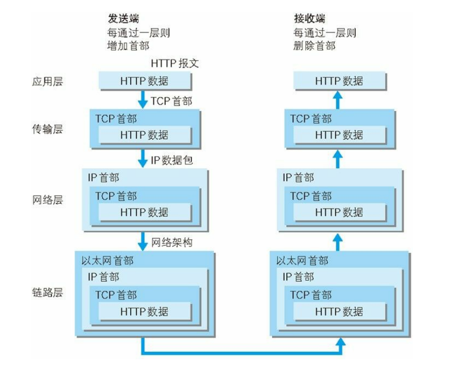

## 一. HTTP状态码
当客户端向服务器端发送请求时，描述返回的请求结果。

## 1.成功状态码（2XX）
- `200 OK`：请求被正常处理。
- `204 No Content`：请求已成功处理，但返回的响应报文中不含实体的主体部分。
- `206 Partial Content`：客户端进行了范围请求。

## 2.重定向状态码(3XX)
- `301 Moved Permanently`：永久性重定向,请求的资源已被分配了新的 URI，应使用新URI访问资源。
- `302 Found`：临时性重定向。请求的资源已被分配新URI，希望本次使用新URI访问。
- `303 See Other`：与302 Found 状态码有着相同的功能，但 303 状态码明确表示采用 GET 方法获取资源。
- `304 Not Modified`：客户端发送附带条件的请求，满足条件时允许请求访问资源，未满足条件时。304 状态码返回不包含任何响应的主体部分。

## 3. 客户端错误(4XX)

- `400 Bad Request`：请求报文中存在语法错误。
- `401 Unauthorized`：发送的请求需要有通过 HTTP 认证（BASIC 认证、DIGEST 认证）的认证信息。若之前已进行过 1 次请求，表示认证失败。
- `403 Forbidden`：请求资源的访问被服务器拒绝。
- `404 Not Found`：服务器上无法找到请求的资源。

## 4.服务器错误(5XX)

- `500 Internal Server Error`：服务器端在执行请求时发生了错误。也有可能是 Web应用存在的 bug 或某些临时的故障。
- `503 Service Unavailable`：服务器暂时处于超负载或正在进行停机维护，无法处理请求。
## 二. TCP/IP栈
### 1.分层
- `应用层` 
   决定了向用户提供应用服务时通信的活动,如DNS服务、HTTP、FTP协议。

- `传输层`
	提供处于网络连接中的两台计算机之间的数据传输。TCP、UDP协议。

- `网络层`
	处理在网络上流动的数据包。数据包是网络传输的最小数据单位。如IP协议、ARP协议。

- `链路层`
	处理连接网络的硬件部分。包括控制操作系统、硬件的设备驱动、网络适配器,及光纤等物理可见部分。

### 2.传输
- 传输流

- 封装

	数据在层与层之间传输时，每经过一层时必定会被打上一个该层所属的首部信息，并在接收端逐层消去

### 3. 协议
- DNS 服务（域名解析）

  域名解析服务，例如`www.google.com`解析`216.58.200.23`，基于UDP协议。
- IP 协议（传输）

 	位于网络层，利用`IP地址`(可变)和`MAC地址`（网卡固定地址）把各种数据包准确传送给对方，使用ARP协议凭借 MAC 地址进行通信。

  `ARP协议`：即地址解析协议，通过IP地址获取物理地址的一个TCP/IP协议。

  `ARP攻击`： 通过伪造IP/Mac地址实现ARP欺骗从而造成网络阻塞/中间人攻击。只能在局域网内网进行。

- TCP协议（确保准确性）

	位于传输层，将大块数据分割成以`报文段`（segment）为单位的数据包进行管理，`不会丢包`。

	TCP建立连接采用`三次握手策略`，防止出现失效的连接请求报文段被服务端接收的情况，从而产生错误。若网络原因造成了超时，握手过程中断，TCP协议会再次以相同的顺序发送相同的数据包。

  可以想象如下场景。客户端发送了一个连接请求 A，但是因为，这时 TCP 会启动超时重传的机制再次发送一个连接请求 B。此时请求顺利到达服务端，服务端应答完就建立了请求，然后接收数据后释放了连接。

  假设这时候连接请求 A 在两端关闭后终于抵达了服务端，那么此时服务端会认为客户端又需要建立 TCP 连接，从而应答了该请求并进入 ESTABLISHED 状态。但是客户端其实是 CLOSED 的状态，那么就会导致服务端一直等待，造成资源的浪费。

- UDP协议（确保实时性）

  - `面向无连接`
  
    不需要和 TCP 一样在发送数据前进行三次握手建立连接的，想发数据就可以开始发送。

  - `不可靠性`

    1.通信都不需要建立连接，无法确认对方是否已经正确接收到数据。

    2.没有拥塞控制，一直会以恒定的速度发送数据，但网络不好时容易发生`丢包`。
### 4.URI和URL
 `URI`：统一资源标识符，由某个协议方案(`http、ftp、file`等)表示的资源的定位标识符

 `URL`：统一资源定位符
## 三. HTTP/HTTPS
### Get / Post
`副作用`：指对服务器上的资源做改变，搜索是无副作用的，注册是副作用的。

`幂等`：指发送 M 和 N 次请求（两者不相同且都大于 1），服务器上资源的状态一致，比如注册 10 个和 11 个帐号是不幂等的，对文章进行更改 10 次和 11 次是幂等的。因为前者是多了一个账号（资源），后者只是更新同一个资源。
1. 技术
  - Get 请求能`缓存`，Post 不能
  - Post 相对 Get `安全`一点点，因为Get 请求都包含在 URL 里，且会被浏览器保存历史纪录。Post 不会，但是在抓包的情况下都是一样的。
  - URL有`长度限制`，会影响 Get 请求，但是这个长度限制是浏览器规定的，不是 RFC 规定的
  - Post 支持`更多编码类型`且不对数据类型限制
2. 应用场景

    Get 多用于搜索关键字。Post 多用于注册。
### HTTP
  - 无状态协议：状态保存用`cookie`
  - 端口：80
  - 通信快，使用明文通信
  - 不验证通信方身份，也无法验证报文完整性
### HTTPS
HTTPS 并非应用层的新协议。只是 HTTP 通信接口部分用`SSL`（Secure Socket Layer,安全套接层）和 `TLS`（Transport Layer Security，安全层传输协议）协议代替而已。
 - HTTP + SSL + TLS状态管理
 - 端口: 443
 - 通信较HTTP慢，占用更多的资源
 - CA证书比较昂贵
## 四. 常见Web攻击技术
对 Web 应用的攻击模式有`主动攻击`和`被动攻击`。
### 1.主动攻击
通过直接访问Web传入攻击代码，直接针对服务器上的资源进行攻击从而访问资源。
- `SQL注入攻击`：针对 Web 应用使用的数据库，通过运行非法的 SQL而产生的攻击
- OS命令攻击：通过 Web 应用，执行非法的操作系统命令达到攻击的目的

### 2. 被动攻击
利用圈套策略执行攻击代码的攻击模式，不直接对web访问进行攻击
- `XSS`跨站脚本攻击
- `CSRF`跨站点请求伪造
- HTTP 首部注入攻击

## 五. 输入url到渲染界面发生了啥
1. DNS服务将输入的url域名解析成IP地址
2. 建立连接，TCP握手/UDP + TLS握手

3. 服务器响应返回状态码

4. 浏览器根据状态码报错(`400 Bad Request`, `500 Internal Sever Error`)或者接收(`200 OK`)响应

5. 浏览器将返回的经过编码的数据包解析，HTML文件解析为DOM树,CSS文件解析为CSSOM，js文件根据`async/defer`异步或者延时加载。