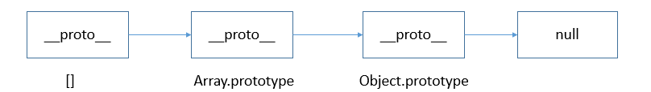

# 一.JS类型判断
基本类型： null, undefined, number, string, boolean, symbol

对象类型: object
## 1. `typeof`(返回值为string类型)
- 对于基本类型，除了null之外均返回正确值
```javascript
  typeof null // object
  typeof undefined // undefined
  typeof 1 // number
  typeof true // boolean
  typeof '1' // string
  typeof Symbol() // symbol
```
- 对于对象类型，除了function外均返回object
```javascript
  typeof new Date() // object
  typeof console.log // function
```
## 2. `instanceof`(返回值为boolean类型)
- 原理
```bash
instanceof (A,B) = {
    var L = A.__proto__;
    var R = B.prototype;
    if(L === R) {
        // A的内部属性 __proto__ 指向 B 的原型对象时，就认为 A 就是 B 的实例
        return true;
    }
    return false;
}
```
- 判断两个对象是否属于实例关系， 而不能判断实例具体类型
```javascript
  [] instanceof Array // true
  [] instanceof Object // true
```

[ ].__proto__  指向 Array.prototype，而 Array.prototype.__proto__ 又指向了Object.prototype，最终 Object.prototype.__proto__ 指向了null，标志着原型链的结束


- 不能跨框架

eg. 框架0的数组无法在框架1判定是否为Array的实例对象
```javascript
  xArray = window.frames[0].Array;
  var arr = new xArray(1,2,3); // [1,2,3]
  arr instanceof Array; // false
```
`[解决方法]`
 使用Array.isArray() 方法 。该方法用以确认某个对象本身是否为 Array 类型，而不区分该对象在哪个环境中创建。


## 3. `constructor`
1. 函数 F被定义时，JS引擎会为F添加 prototype 原型，并在prototype上添加 constructor 属性，使其指向 F 的引用。


2. F 利用原型对象上的 constructor 引用了自身，当 F 作为构造函数来创建对象时，f 是F的实例对象，原型上的 constructor 就被遗传到了新创建的对象上， 从原型链角度讲，构造函数 F 就是新对象的类型。


3. `null, undefined`为无效对象，不存在constructor

## 4. `toString`(返回[Object Type])`[推荐]`
对于 Object 对象，直接调用 toString()  就能返回 [object Object] 。而对于其他对象，则需要通过 call / apply 来调用才能返回正确的类型信息。

```javascript
  Object.prototype.toString.call(null) // [Object Null]
  Object.prototype.toString.call(undefined) // [Object Undefined]
```