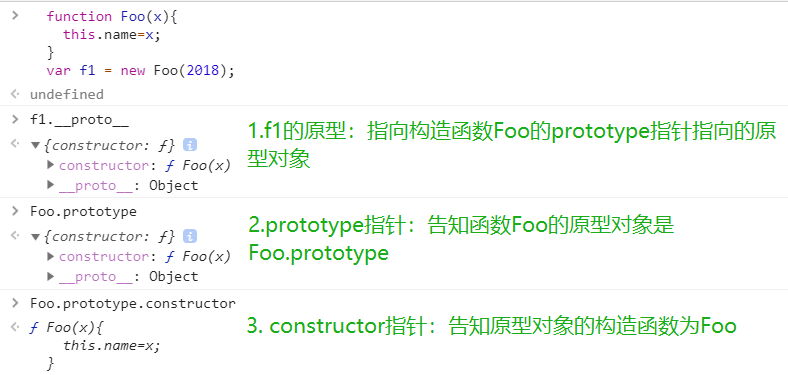

# 一. JS类型判断
基本类型： null, undefined, number, string, boolean, symbol

对象类型: object
## 1. `typeof`(返回值为string类型)
- 对于基本类型，除了null之外均返回正确值
```javascript
  typeof null // object
  typeof undefined // undefined
  typeof 1 // number
  typeof true // boolean
  typeof '1' // string
  typeof Symbol() // symbol
```
- 对于对象类型，除了function外均返回object
```javascript
  typeof new Date() // object
  typeof console.log // function
```
## 2. `instanceof`(返回值为boolean类型)
- 原理
```bash
instanceof (A,B) = {
    var L = A.__proto__;
    var R = B.prototype;
    if(L === R) {
        // A的内部属性 __proto__ 指向 B 的原型对象时，就认为 A 就是 B 的实例
        return true;
    }
    return false;
}
```
- 判断两个对象是否属于实例关系， 而不能判断实例具体类型
```javascript
  [] instanceof Array // true
  [] instanceof Object // true
```

[ ].__proto__  指向 Array.prototype，而 Array.prototype.__proto__ 又指向了Object.prototype，最终 Object.prototype.__proto__ 指向了null，标志着原型链的结束


- 不能跨框架

eg. 框架0的数组无法在框架1判定是否为Array的实例对象
```javascript
  xArray = window.frames[0].Array;
  var arr = new xArray(1,2,3); // [1,2,3]
  arr instanceof Array; // false
```
`[解决方法]`
 使用Array.isArray() 方法 。该方法用以确认某个对象本身是否为 Array 类型，而不区分该对象在哪个环境中创建。


## 3. `constructor`
1. 函数 F被定义时，JS引擎会为F添加 prototype 原型，并在prototype上添加 constructor 属性，使其指向 F 的引用。


2. F 利用原型对象上的 constructor 引用了自身，当 F 作为构造函数来创建对象时，f 是F的实例对象，原型上的 constructor 就被遗传到了新创建的对象上， 从原型链角度讲，构造函数 F 就是新对象的类型。


3. `null, undefined`为无效对象，不存在constructor

## 4. `toString`(返回[Object Type])`[推荐]`
对于 Object 对象，直接调用 toString()  就能返回 [object Object] 。而对于其他对象，则需要通过 call / apply 来调用才能返回正确的类型信息。

```javascript
  Object.prototype.toString.call(null) // [Object Null]
  Object.prototype.toString.call(undefined) // [Object Undefined]
```
# 二. JS类型转换
除 `undefined， null， false， NaN， ''， 0， -0，`外,其他所有值都转为 true，包括所有对象(eg.`[ ]`, `{ }`)
## 1. `对象转基本类型`
对象在转换基本类型时，会调用两个可重写的 `valueOf` 和 `toString`方法，并返回原始类型的值。

- ###  调用优先度
1. `Symbol.toPrimitive`,调用优先级最高
```javascript
let a = {
  valueOf() {
    return 0;
  },
  toString() {
    return '1';
  },
  [Symbol.toPrimitive]() {
    return 2;
  }
}
1 + a // => 3
'1' + a // => '12'
```
2. 对象倾向于转换为 Number ，优先调用 valueOf；倾向于转换为 String ，就调用 toString
3. 当先调用的方法未返回正确的原始类型的值，则会调用另一个方法，若两个方法均未返回则报错
```javascript
  var obj = {
  toString () {
    console.log('toString')
    return {}
  },
  valueOf () {
    console.log('valueOf')
    return {}
  }
}

console.log(1 + obj)

// 报错。无法将一个对象转换为原始类型的值
Uncaught TypeError: Cannot convert object to primitive value
```
3. 优先调用未重写的方法

## 2. 四则运算符
- `加法运算`：一方是字符串类型，就会把另一个也转为字符串类型
- `其他运算`：其中一方是数字，那么另一方就转为数字

加法运算会触发三种类型转换：`将值转换为原始值(primitive value)=>转换为数字(valueOf)=>转换为字符串(toString)`
```javascript
1 + '1' // '11'
2 * '2' // 4

'1' + +'b' +'1'
// +'b'.toString() -> 'NaN'
// +'1'.toString() -> '1'
//'1' + +'b' +'1'//  '1NaN1'

[1, 2] + [2, 1]
// [1, 2].toString() -> '1,2'
// [2, 1].toString() -> '2,1'
// '1,2' + '2,1' = '1,22,1'
```
## 3. `==`操作符（返回boolean值）
`==`运算符“喜欢”将左右两边值转为`number`类型来比较
```javascript
  undefined == null // true
  undefined === null // false
  [] == ![] // true
```

```javascript
  1. 右边
  // [] 转成 true，然后取反变成 false
  [] == false
  // 根据第 8 条得出
  [] == ToNumber(false)
  [] == 0
  2. 左边
  // 根据第 10 条得出
  ToPrimitive([]) == 0
  // [].toString() -> ''
  '' == 0
```
# 三. JS原型与继承
函数的 `prototype` 是一个对象，也就是原型
- ## 原型链
对象的属性不仅仅是它本身拥有的属性，它还会从其他对象中继承一些属性。

当js在一个对象中找不到需要的属性时,它就会利用自身的`__proto__`属性到父对象上去找，以此类推，这就构成了对象的原型链。
> 通过`hasOwnProperty()`在对象及其原型链上查找属性。有则返回true

1. 每个函数都有 `prototype `（显式）属性，除了 `Function.prototype.bind()`，该属性指向原型。
2. 每个对象都有` __proto__` （隐式）属性，指向了创建该对象的构造函数的原型对象，并继承原型对象的所有属性
```javascript
  function Foo(x){
    this.name=x;
  }
  var f1 = new Foo(2018); // f1为对象， Foo为f1的构造函数
```


- ## 原生对象的继承关系


### 1. Foo的原型：函数Foo的构造函数是`function Function()`，Function()的prototype指向了一个对象`Function.prototype`，故函数Foo的原型指向Function.prototype。

### 2. 对象Function.prototype的原型：对象`Function.prototype`的构造函数是`function Object()`,`function Object()`的prototype指针指向`Object.prototype`,即Function.prototype的原型为Object.prototype(该对象定义了所有对象共有的属性，比如hasOwnProperty()和toString()等。)

### 3. Object.prototype就是原型链的终点了，它的__proto__是null，js查找属性时，如果到这里还没有找到，那就是undefined了。

### 4. Function.proto === Function.prototype
> 这并不意味着Fuction自己产生了自己
- 所有对象通过原型链最终找到 Object.prototype ，而Object.prototype则是由引擎自己创建的。意味着`所有实例都是对象，但是对象不一定都是实例。`
- 一般而言，函数通过 new Function() 生成的，而Function是由引擎自己创建的。首先引擎创建了 Object.prototype ，然后创建了 Function.prototype ，并且通过` __proto__ `将两者联系了起来。

# 四. new操作符
对于实例对象来说，都是通过 new 产生的，无论是 function Foo( ) 还是 let a = { b : 1 } 。
- 过程
```javascript
  function Animal(name){
    this.name = name;
  }
  var cat = new Animla('cat');
  // 1. 创建一个空对象obj
  // 2. 建立obj的原型链：obj->Animal.prototype->Object.prototype->null
  // 3. 绑定 this，执行构造函数：let result = Animal.apply(obj, arguments)
  // 4. 确保返回一个新对象：return typeof result === 'object' ? result : obj
```
- new的优先级

### 优先级: `new Foo()` > `new Foo`

```javascript
  new Foo.getName();   // -> new (Foo.getName());   
  new Foo().getName(); // -> (new Foo()).getName();
```

# 五. this的指向
## `[this是在函数执行时被绑定的，它始终指向调用当前函数的那个对象]`
## 调用函数有四种形式：
### 1.作为方法被调用
函数作为对象的属性时称为方法。

函数作为方法被调用时，this指向保存这个方法的对象。
```javascript
      var name = "window";
      var obj_0 = {
          name: "goozyshi",
          sayName: function() {  // 方法  
              console.log(this.name);
          }
      };
      obj_0.sayName();  //  goozyshi

      var f = obj_0.sayName;
      // 这里的sayNamme作为函数f被调用
      f();//  window
```
### 2. 作为全局函数被调用
this被绑定为全局对象，即`window`对象。
```javascript
      var name = "window";
      function sayName() {
          console.log(this.name);
      }
      sayName();
```
### 3. 作为构造函数被调用
使用`new`时，函数的this会被绑定到其实例对象上。
```javascript
  function Obj_1() {
          this.name = "goozyshi";
      }
      var person = new Obj_1(); // this绑定到person 
      console.log(person.name); // goozyshi
```
### 4. 被apply/call调用
`apply`和`call`都可以将`this`重新绑定到特定对象中。

唯一区别是apply接受的是数组参数，call接受的是连续参数。
```javascript
      var name = "window";
      var person = {
          name: "goozyshi"
      };
      var ace = {
          name: "ace"
      };
      function sayName() {
          console.log(this.name);
      }
      sayName(); //window
      sayName.apply(person); // goozyshi
```
# 六. 执行上下文
`执行上下文（Execution Context）`是保存着函数执行所需的重要信息的对象

当执行js代码时，会产生3种执行上下文
- 全局执行上下文
- 函数执行上下文
- eval 执行上下文

执行上下文有三个属性：
  - 变量对象(variable object)
  - 作用域链(scope chain)
  - this指针(this value)

### 1.执行顺序
每次开始执行一个函数之前，js都要创建一个上下文对象，并将其压入上下文栈中。

正在执行的函数的上下文总是在栈顶，这个函数一执行完，上下文就会从栈中弹出。
```javascript
function fun2() {
    var b = 222;
}
function fun1() {
    var a = 111;
    fun2();
}
fun1();
c = 333;
```
1. 开始执行时：
栈顶：全局上下文
2. 代码执行到`fun1()`;时，压入fun1的上下文。这时栈变成：
栈顶：fun1上下文 / 全局上下文
3. 代码执行到`fun2()`;时，压入fun2的上下文。这时栈变成：
栈顶：fun2上下文 / fun1上下文 / 全局上下文
4. fun2执行完毕，fun2上下文弹出：
栈顶：fun1上下文 / 全局上下文
(这时执行权回到fun1内，栈顶也恰好回到了fun1上下文。可见这种机制能保证正在执行的函数的上下文总是在栈顶)
5. fun1执行完毕，fun1上下文弹出，执行权回到全局区域：
栈顶：全局上下文
6. 所有代码都执行完毕，全局上下文弹出，栈为空。
### 2. 执行过程
>函数还未开始执行（创建上下文的期间）时叫变量对象(VO)，函数开始执行以后就叫活动对象(AO)。
- 第一个阶段（创建阶段——`创建变量对象VO`）
 
  JS 解释器找出需要提升的变量和函数，并且给他们提前在内存中开辟好空间

  函数的话会将整个`函数存入内存`中

  `变量只声明并赋值为 undefined`(ES6中的let只声明不赋值)
  

- 第二个阶段（代码执行阶段）

  此时可以直接使用声明了的变量、函数。
```javascript
function fun1(var arg) {
    // 第一阶段
    // 创建变量对象：{arg:987, fun2:fun2的地址, a:undefinded}
    console.log(a);  // 打印undefinded，因为活动对象中有键值对：a:undefinded。
    var a = 111;      // 如果将这一语句删除，上一句会直接报错！
    console.log(a);  // 打印111，因为活动对象中有键值对：a:111
    fun2();          // 打印in fun2! 因为活动对象中有键值对：fun2：某个内存地址
    return;          // 即使是在return之后的声明，也会被放入变量对象！
    function fun2() {
        console.log('in fun2!');
    }
}
fun1(987);
// 输出为：
// undefined
// 111
// in fun2!

```
### 3.立即执行函数与匿名函数

```javascript
  // 1.具名函数
  function xxx(){ // 函数声明(声明一个有名字的函数)
      console.log("functionName is xxx"); // functionName is xxx
  }
  xxx() // 执行该函数

  // 2.匿名函数
  function(){ // 报错，声明后无法被执行（因为不知道叫啥）
    console.log("do not have a functionName");
  }
  // 解决方法： 让其立即执行
  ( function(){
    console.log("do not have a functionName");// do not have a functionName
    }
  )();

# 七. 闭包
函数 A 返回了一个函数 B，并且函数 B 中使用了函数 A 的变量，函数 B 就被称为闭包。
```javascript
function A() {
    let a = 1
    function B() {
        console.log(a)  // a存储在堆上，故而不会因为调用栈的关系而被弹出 
        // JS 引擎通过逃逸分析辨别出哪些变量需要存储在堆上，哪些需要存储在栈上
    }
    return B
}
```
解决循环中异步`var`作用域问题：
```javascript
for ( var i=1; i<=5; i++) {
	setTimeout( function timer() {
		console.log( i );
	}, i*1000 );// setTimeout为异步函数，先执行了循环，最终输出全是6
}
```
1. 使用块级作用域`let`
```javascript
    for ( let i=1; i<=5; i++) {
        setTimeout( function timer() {
            console.log( i );
        }, i*1000 );
    }
```
2. 使用`setTimeout()`的第三个参数
```javascript
    for ( var i=1; i<=5; i++) {
        setTimeout( function timer(j) {
            console.log( j );
        }, i*1000, i);// setTimeout(func,delay,param1, param2,...)param作为func的参数
    }
```
3. 闭包
```javascript
    for ( var i=1; i<=5; i++) {
    (function(j){
			setTimeout( function timer() {
				console.log( j );
			}, j*1000 );
    })(i)
    }
```

# 八. 深浅拷贝
当两个对象来自同一引用时，一方改变会引起另一方跟着变化。
```javascript
let a = {
    age: 1
}
let b = a
a.age = 2
console.log(b.age) // 2
```
## 1. 浅拷贝
使用`...`拓展运算符或者`Object.assign`进行浅拷贝。
```javascript
let a = {
    age: 1,
    jobs: {
        first: 'FE'
    }
}
let b = {...a} 
a.age = 2,
console.log(b.age) // 1

// 浅拷贝只能解决了第一层的问题
a.jobs.first = 'native'
console.log(b.jobs.first) // native
```
## 2. 深拷贝
使用`JSON.parse(JSON.stringify(object))`进行深拷贝。
```javascript
	let b = JSON.parse(JSON.stringify(a));
```
但此方法有如下局限性：
- 会忽略`undefined`
- 无法序列化`函数`
- 无法解决循环引用的对象

## `[完美解决方式]`
 1. 数据含有以上三种情况：
```javascript
let b = _.cloneDeep(a);// loadsh的深拷贝函数
```
 2. 拷贝对象不包含函数：`MessageChannel`(1.异步方法 2.可处理 undefined 和循环引用对象)

 # 九. 防抖与节流
 防止用户抽风式狂点按钮或其他可以触发函数事件的组件
## 1. 防抖
将多次执行变为最后一次执行

设置一个定时器，给定一个延迟，如果在用户点击间隔小于给定的延迟时间，就清空上一个定时器，重新计时。
```javascript
// func是用户传入需要防抖的函数
// wait是等待时间
const debounce = (func, wait = 50) => {
  // 缓存一个定时器id
  let timer = 0
  // 这里返回的函数是每次用户实际调用的防抖函数
  // 如果已经设定过定时器了就清空上一次的定时器
  // 开始一个新的定时器，延迟执行用户传入的方法
  return function(...args) {
    if (timer) clearTimeout(timer)
    timer = setTimeout(() => {
      func.apply(this, args)
    }, wait)
  }
}
// 不难看出如果用户调用该函数的间隔小于wait的情况下，上一次的时间还未到就被清除了，并不会执行函数
```
- 对于按钮防点击来说的实现：如果函数是立即执行的，就立即调用，如果函数是延迟执行的，就缓存上下文和参数，放到延迟函数中去执行。一旦我开始一个定时器，只要我定时器还在，你每次点击我都重新计时。一旦你点累了，定时器时间到，定时器重置为 null，就可以再次点击了。
- 对于延时执行函数来说的实现：清除定时器ID，如果是延迟调用就调用函数
## 2. 节流
将多次执行变成每隔一段时间执行

# 十. 继承（简）
- 对象冒充
- 原型链

    先创建父类实例 => 改变实例原先的` _proto__ `转而连接到子类的 prototype => 子类的 prototype 的 `__proto__ `改为父类的 prototype

- 混合模式

# XI.异步
## 1. Promise
处理异步，解决回调地狱

可以把 Promise 看成一个状态机：

初始状态是 `pending`  ( 仅`pending`状态可改变且只可变一次 )

通过 `resolve `和` reject `函数，

将状态转变为` resolved `或者 `rejected` 状态

`then`函数会返回一个新的`Promise 实例`，如果返回的是一个相同实例的话，多个 then 调用就失去意义了。

## 2. Generator
 `*` 表示这是一个 Generator 函数,返回一个含有`next`方法的对象

` yield` 暂停代码

 `next` 恢复执行被暂停的代码
```javascript

function* test() {
  let a = 1 + 2;
  yield 2;
  yield 3;
}
let b = test();
console.log(b.next()); // >  { value: 2, done: false }
console.log(b.next()); // >  { value: 3, done: false }
console.log(b.next()); // >  { value: undefined, done: true }
```
## 3. async 和 await
`async` 使函数返回值使用 Promise.resolve() 包裹

`await` 只能在 `async `函数中使用,且会等待函数` resolve`,阻塞之后的代码（即使是同步）

很好的处理` then `的调用链，能够更清晰准确的写出代码
```javascript
function sleep() {
  return new Promise(resolve => {
    setTimeout(() => {
      console.log('finish')
      resolve("sleep");
    }, 2000);
  });
}
async function test() {
  let value = await sleep();
  console.log("object");
}
test()
// finish
// object
```

