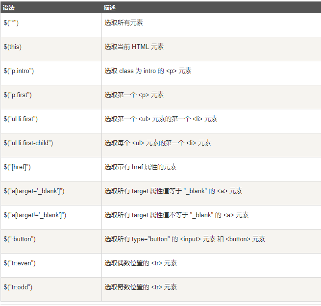
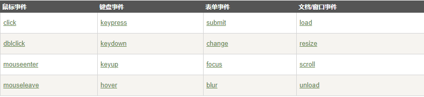

# jQuery
## 一.基础语法
`$(selector).action()`
- 美元符号定义 jQuery
- 选择符（selector）"查询"和"查找" HTML 元素
- jQuery 的 action() 执行对元素的操作

`selector`
- 元素选择器： $('p')
- id选择器：$('#id')
- class选择器：$('p.class')

## [jQuery 事件](http://www.runoob.com/jquery/jquery-events.html)

## 二.效果
- 显示隐藏:

$(selector).`hide`(speed,callback)：隐藏

$(selector).`show`(speed,callback)：显示

$(selector).`toggle`(speed,callback)：隐藏/显示切换

`speed`: 规定隐藏/显示的速度（单位：ms）

`callback` : 隐藏或显示完成后所执行的函数名称。
- 淡入淡出

$(selector).`fadeIn`(speed,callback)：淡入(出现)

$(selector).`fadeOut`(speed,callback)：淡出（消失）

$(selector).`fadeToggle`(speed,callback)：淡入/淡出切换

$(selector).`fadeTo`(speed,opacity,callback)：允许渐变为指定不透明度

- 滑动

$(selector).`slideDown`(speed,callback)：向下滑动元素

$(selector).`slideUp`(speed,callback)：用于向上滑动元素

$(selector).`slideToggle`(speed,callback)：向上/向下切换

- 动画 && 停止动画

  - $(selector).`animate`({params},speed,callback)：创建自定义动画

    >多个动画逐一运行

    `params`：必需，定义形成动画的 CSS 属性。

    `speed`：可选，规定效果的时长。它可以取以下值："slow"、"fast" 或毫秒。

    `callback`：可选，动画完成后所执行的函数名称。

  - $(selector).`stop`(stopAll,goToEnd)：停止动画或效果

    `stopAll`: 可选，是否应该清除所有动画队列。默认是 false，即仅停止活动的动画，允许任何排入队列的动画向后执行。

    `goToEnd`：可选，是否立即完成当前动画。默认是 false。

