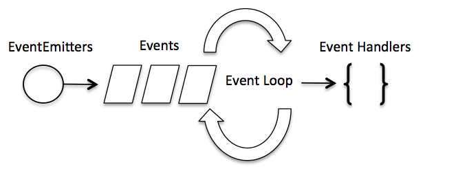
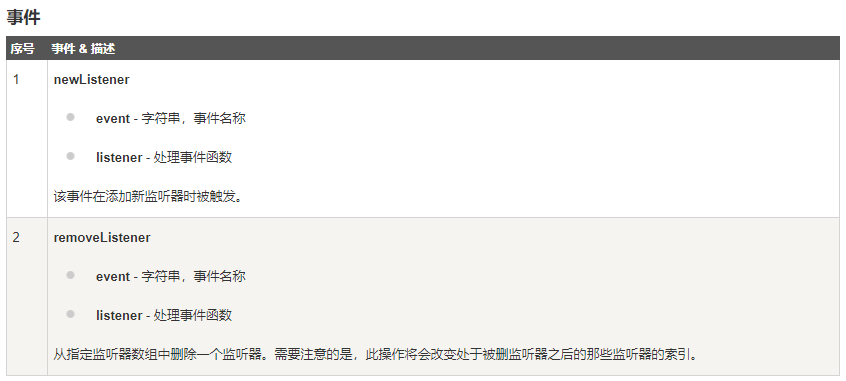

# Node
- 实例1：创建服务器
```javascript
/***
 * 引入模块
 */
var http = require("http");

/**
 * 创建服务器
 * listen 方法绑定 8888 端口
 * request, response 参数来接收和响应数据
 */
http.createServer(function(req, res) {
  // 发送头部、状态值、内容类型
  res.writeHead(200, {'Content-Type' : 'text/plain'})

  // 发送响应
  res.end('Hello Me')
}).listen(8088);
console.log(`服务已开启：http:127.0.0.1:8088\n`)
```
- 实例2：异步
```javascript
/**
 * 文件读取
 */
var fs = require("fs");

// 阻塞代码（同步）
var data = fs.readFileSync('input.txt');
console.log('读取input.text：'+ data.toString());
// 非阻塞（异步）
fs.readFile('input.txt', function (err, data) {
    if (err) return console.error(err);
    console.log(data.toString());
});
console.log("程序执行结束!");
```
- 实例3： 事件驱动程序


```javascript
/**
 * 事件驱动程序
 */
var events = require("events");

// 创建 eventEmitter 对象
var eventEmitter = new events.EventEmitter();

// 创建事件处理程序
var connectHandler = function connected(){
  console.log(`连接成功`)
  // 触发事件
  eventEmitter.emit('data_received')
}

// 绑定connection事件处理程序
eventEmitter.on('connection', connectHandler);

// 匿名函数绑定data_receiced
eventEmitter.on('data_received', function(){
  console.log(`数据接收成功`)
})
// 触发connection事件
eventEmitter.emit('connection')
console.log(`结束`)
```
|方法|描述|
|:--:|:--:|
|	addListener(event, listener)|为指定事件添加一个监听器到监听器数组的尾部。|
|on(event, listener)|为指定事件注册一个监听器，接受一个字符串 event 和一个回调函数。|
|once(event, listener)|为指定事件注册一个单次监听器，即 监听器最多只会触发一次，触发后立刻解除该监听器。|
|removeListener(event, listener)|移除指定事件的某个监听器，监听器必须是该事件已经注册过的监听器。它接受两个参数，第一个是事件名称，第二个是回调函数名称。|
|removeAllListeners([event])|移除所有事件的所有监听器， 如果指定事件，则移除指定事件的所有监听器。|
|setMaxListeners(n)|默认情况下， EventEmitters 如果你添加的监听器超过 10 个就会输出警告信息。 setMaxListeners 函数用于提高监听器的默认限制的数量。|
|listeners(event)|返回指定事件的监听器数组。|
|emit(event, [arg1], [arg2], [...])|按参数的顺序执行每个监听器，如果事件有注册监听返回 true，否则返回 false。|


