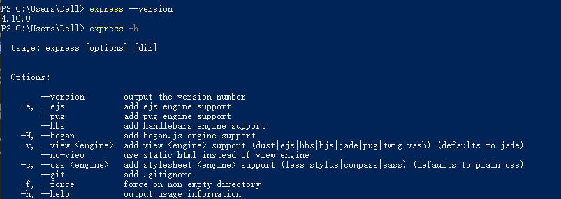
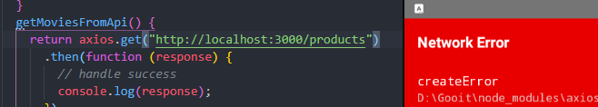
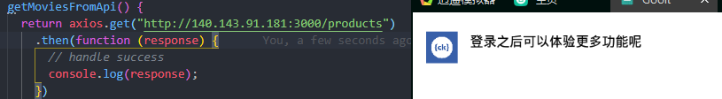

# 服务器部署到腾讯云
## 一. 搭建本地服务器项目
- Node.js作为服务器语言([官网](http://nodejs.cn/))
- Express作为服务器框架([官网](http://www.expressjs.com.cn/))
- RESTful API规范([表述性状态转移接口规范](https://www.runoob.com/w3cnote/restful-architecture.html))
1. 安装和使用Express

  ```javascript
  npm i express-generator -g  // 全局安装
  ```
  
2. 验证是否成功
```javascript
express --version // 查看express版本号
express -h // 查看express语法帮助
```


3. 初始化项目
```javascript
express --view=ejs myProject //使用ejs模板引擎新建项目
```


## 二. 购买搭建腾讯云（或阿里云）
### 1. 购买腾讯云服务器（Cloud Virtual Machine，CVM）:[点击访问](https://www.jianshu.com/p/5b6587b95901)
### 2. 快速配置`Windows/Linux`: [点击访问](https://cloud.tencent.com/document/product/213/2936)
### 3. [安装IIS](https://cloud.tencent.com/document/product/213/2755)
### 4. [在腾讯云(windows)上搭建node.js服务器](https://www.bbsmax.com/A/1O5EbZkbd7/)
### 5. [Windows Server 2012开放端口供外部访问](https://blog.csdn.net/a12345555555/article/details/72722161)

## 三. Tips:

`react-native` 使用`模拟器`对nodejs的localhost:3000发起请求时会报Network Error,原因在于模拟器的localhost不是本机电脑的localhost所以访问不到node搭建的服务器。

出现错误：



修改成本机IP:



