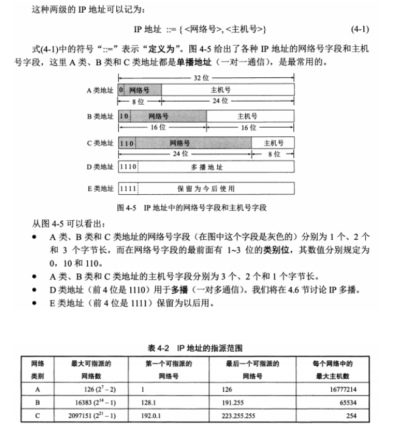

# 一. 网络基础
## 1. OSI，TCP/IP，五层协议的体系结构，以及各层协议
- OSI分层 （7层）：物理层、数据链路层、网络层、传输层、会话层、表示层、应用层。

- TCP/IP分层（4层）：网络接口层、 网际层、运输层、 应用层。

- 五层协议 （5层）：物理层、数据链路层、网络层、运输层、 应用层。

每一层的作用及协议如下：

物理层：通过媒介传输比特,确定机械及电气规范（`比特Bit`）。**RJ45、CLOCK、IEEE802.3 （中继器，集线器）**

数据链路：将比特组装成帧和点到点的传递（`帧Frame`）。**PPP、FR、HDLC、VLAN、MAC （网桥，交换机）**

网络层：负责数据包从源到宿的传递和网际互连（`包PackeT`）。**IP、ICMP、ARP、RARP、OSPF、IPX、RIP、IGRP、 （路由器）**

传输层：提供端到端的可靠报文传递和错误恢复（`段Segment`）。**TCP、UDP、SPX**

会话层：建立、管理和终止会话（`会话协议数据单元SPDU`）。**NFS、SQL、NETBIOS、RPC**

表示层：对数据进行翻译、加密和压缩（`表示协议数据单元PPDU`）。**JPEG、MPEG、ASII**

应用层：允许访问OSI环境的手段（`应用协议数据单元APDU`）。**FTP、DNS、Telnet、SMTP、HTTP、WWW、NFS**

### [一张图看清计算机网络体系结构](https://uploadfiles.nowcoder.com/images/20180410/4039680_1523328974264_E4E1F3318AF5F32719A15808E8D8458B)

## 2. IP地址分类

- A 类地址(1~126)：网络号占前8位，以0开头，主机号占后24位。

- B 类地址(128~191)：网络号占前16位，以10开头，主机号占后16位。

- C 类地址(192~223)：网络号占前24位，以110开头，主机号占后8位。

- D 类地址(224~239)：以1110开头，保留位`多播地址`。

- E 类地址(240~255)：以1111开头，`保留`位今后使用。

其中 A、B、C 是基本类，D、E 类作为多播和保留使用。

以下是留用的内部私有地址：

A类 10.0.0.0--10.255.255.255

B类 172.16.0.0--172.31.255.2552

C类 192.168.0.0--192.168.255.255

子网掩码`将IP地址分成更小的网段，提高IP地址的利用率`

IP地址与子网掩码相与得到网络号：

ip       : 192.168.2.110

&

Submask : 255.255.255.0

----------------------------

网络号   ：192.168.2  .0

注:

>主机号，全为0的是网络号（例如：192.168.2.0），主机号全为1的为广播地址（192.168.2.255）

## 3. TCP三次握手和四次挥手的全过程
- ### 三次握手
第一次握手：客户端发送syn包(syn=x)到服务器，并进入SYN_SEND状态，等待服务器确认；

第二次握手：服务器收到syn包，必须确认客户的SYN（ack=x+1），同时自己也发送一个SYN包（syn=y），即SYN+ACK包，此时服务器进入SYN_RECV状态；

第三次握手：客户端收到服务器的SYN＋ACK包，向服务器发送确认包ACK(ack=y+1)，此包发送完毕，客户端和服务器进入ESTABLISHED状态，完成三次握手。

握手过程中传送的包里不包含数据，三次握手完毕后，客户端与服务器才正式开始传送数据。理想状态下，TCP连接一旦建立，在通信双方中的任何一方主动关闭连接之前，TCP 连接都将被一直保持下去。

- ### 四次挥手
与建立连接的“三次握手”类似，断开一个TCP连接则需要“四次握手”。

第一次挥手：主动关闭方发送一个FIN，用来关闭主动方到被动关闭方的数据传送，也就是主动关闭方告诉被动关闭方：我已经不 会再给你发数据了(当然，在fin包之前发送出去的数据，如果没有收到对应的ack确认报文，主动关闭方依然会重发这些数据)，但是，此时主动关闭方还可 以接受数据。

第二次挥手：被动关闭方收到FIN包后，发送一个ACK给对方，确认序号为收到序号+1（与SYN相同，一个FIN占用一个序号）。

第三次挥手：被动关闭方发送一个FIN，用来关闭被动关闭方到主动关闭方的数据传送，也就是告诉主动关闭方，我的数据也发送完了，不会再给你发数据了。

第四次挥手：主动关闭方收到FIN后，发送一个ACK给被动关闭方，确认序号为收到序号+1，至此，完成四次挥手。

**三次握手**

**四次挥手**

## 4. 在浏览器中输入www.baidu.com后执行的全部过程

1、应用层：DNS解析域名为目的IP，通过IP找到服务器路径，客户端向服务器发起HTTP会话，然后通过运输层TCP协议封装数据包，在TCP协议基础上进行传输

2、运输层：HTTP会话会被分成报文段，添加源、目的端口；TCP协议进行主要工作

3、网络层：为数据包选择路由，IP协议进行主要工作

4、数据链路层：相邻结点的可靠传输，ARP协议将IP地址转成MAC地址。

**事件顺序**

(1) 浏览器获取输入的域名www.baidu.com

(2) 浏览器向DNS请求解析www.baidu.com的IP地址

(3) 域名系统DNS解析出百度服务器的IP地址

(4) 浏览器与该服务器建立TCP连接(默认端口号80)

(5) 浏览器发出HTTP请求，请求百度首页

(6) 服务器通过HTTP响应把首页文件发送给浏览器

(7) TCP连接释放

(8) 浏览器将首页文件进行解析，并将Web页显示给用户。

**涉及到的协议**

(1) 应用层：HTTP(WWW访问协议)，DNS(域名解析服务)

(2) 传输层：TCP(为HTTP提供可靠的数据传输)，UDP(DNS使用UDP传输)

(3) 网络层：IP(IP数据数据包传输和路由选择)，ICMP(提供网络传输过程中的差错检测)，ARP(将本机的默认网关IP地址映射成物理MAC地址)

## 5. TCP和UDP的区别？
- TCP提供面向连接的、可靠的数据流传输，而UDP提供的是非面向连接的、不可靠的数据流传输。
- TCP传输单位称为`TCP报文段`，UDP传输单位称为`用户数据报`。
- TCP适合用于网页，邮件等，UDP适合用于视频，语音广播等

**TCP对应的协议：**

（1） FTP：定义了文件传输协议，使用21端口。

（2） Telnet：一种用于远程登陆的端口，使用23端口，用户可以以自己的身份远程连接到计算机上，可提供基于DOS模式下的通信服务。

（3） SMTP：邮件传送协议，用于发送邮件。服务器开放的是25号端口。

（4） POP3：它是和SMTP对应，POP3用于接收邮件。POP3协议所用的是110端口。

（5）HTTP：是从Web服务器传输超文本到本地浏览器的传送协议。

**UDP对应的协议：**

（1） DNS：用于域名解析服务，将域名地址转换为IP地址。DNS用的是53号端口。

（2） SNMP：简单网络管理协议，使用161号端口，是用来管理网络设备的。由于网络设备很多，无连接的服务就体现出其优势。

（3） TFTP(Trival File Transfer Protocal)，简单文件传输协议，该协议在熟知端口69上使用UDP服务。

## 二. HTML+CSS
